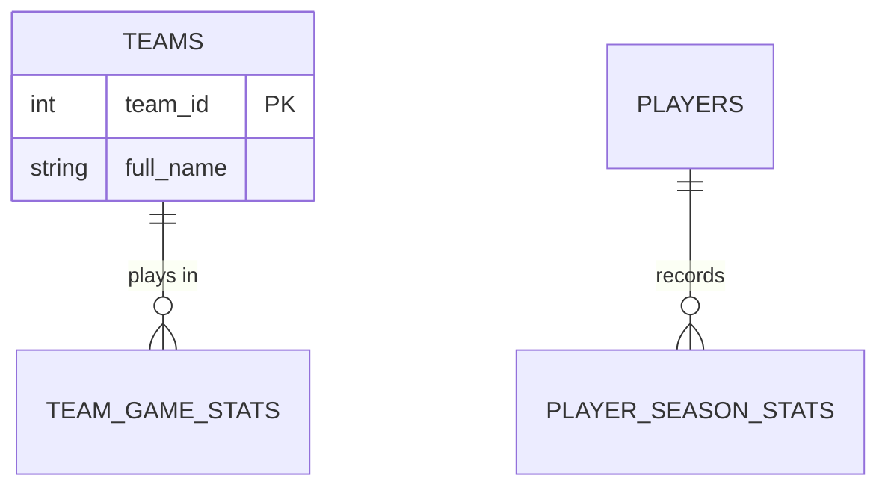

# Database Applications Development — Version 2

## Course Blueprint & Build Plan

**Course:** 145085 — Database Applications Development
**Instructor:** Ryan McMaster · Medina County Career Center
**Placement:** SE1 (Junior), Semester 2 — Quarters 3 & 4
**Daily schedule:** 2.5 hours/day (~2 hours working time)
**Tool:** DB Browser for SQLite

**Graded target:** **Ohio WebXam 145085**, March or April window, with a retake
**Ungraded bonus:** Certiport IT Specialist: Databases (INF-201) — opt-in, after the state exam

**Seven units · 42 instructional days · ~45 : 55 theory-to-applied**

---

## The design principle

The outline contains **40 database competencies**. Nine of them require a student to write SQL — 8.2.1, 8.2.2, 8.3.1, 8.3.2, 8.3.3, 8.5.1, 8.5.2, 8.5.3, 8.5.4. The other thirty-one are assessable at describe level on a written multiple-choice exam, even where the outline's verb is imperative.

That second sentence is a **bet about how the WebXam samples the outline**, not a reading of its verbs. Counted strictly, twenty-eight of the forty carry performance verbs — *House, Control, Log, Backup, Optimize, Implement, Normalize, Generate, Verify*. A written exam has no way to test most of those directly, so the plan teaches them at describe level and accepts the risk. Where a cheap hands-on beat exists, Unit 5 takes it.

So the course is weighted: **two applied units carrying the nine, three theory units carrying the thirty-one.** Earlier drafts had four applied units, which inverted the ratio and added roughly two weeks of lab time the outline doesn't call for.

**Anything not named in the outline is not in the graded course.** Subqueries, `UNION`/`INTERSECT`/`EXCEPT`, `CROSS JOIN`, self-joins, `CREATE VIEW`, and query troubleshooting are all good content — and all absent from the 145085 course outline. They live in the opt-in Certiport block at the end.

⚠️ **Two exceptions that look cuttable but aren't.** **8.5.1** reads "Write SQL scripts *and stored procedures*," and **8.2.2** lists **index** among the constraints to define. Both are in the outline, so both stay in the graded course. Unit 4 covers procedures at describe level and builds real indexes — see that unit.

---

## What we know, and what we're inferring

**Nobody on this project has seen either exam.** Worth stating plainly, because the whole plan is built on inference and the inference should stay visible.

**What we actually have:**

| Source | Status |
|---|---|
| Ohio 2025 course outline for 145085 | **Authoritative.** A real published document. When this plan says "the outline says X," that's checkable. |
| `Certiport_Databases_StudyGuide.md` | **Secondhand.** Built from GMetrix practice exams, not the live exam. Good signal about emphasis; not proof. |
| MeasureUp / uCertify INF-201 listings | **Secondhand.** Third-party vendor marketing describing their own practice products. |
| sqlite.org documentation | **Authoritative** for every claim about what SQLite does and doesn't do. |

**What follows from that:** this plan can say what the *outline* requires, what the *study guide* emphasizes, and what *SQLite* does. It cannot say what either exam asks, weights, or scores — and where you find language in here that sounds like it can, treat it as a drafting error and fix it.

Competency counts in this document are used to estimate **teaching time**, never to predict how a test distributes its items.

*Note: "view" does appear in the outline, at 8.1.2, but as a level of data abstraction (conceptual / logical / physical / view), not as `CREATE VIEW`. Unit 3 covers it in that sense.*

---

## How the two exams differ

- **WebXam 145085** — graded. Built from an outline dominated by *describe, identify, explain, compare* across a wide surface. We're planning for breadth over precision on that basis.
- **Certiport INF-201** — ungraded bonus. The GMetrix-derived study guide and the third-party practice listings both point at a narrow, precision-heavy surface: exact T-SQL syntax, data-type economy, spot-the-error. We're preparing for that shape.

**Scope note:** the outline also carries Strand 5 (Programming & Software Systems). That is taught in the SE1 fall Python arc and is out of scope here.

---

## Why DB Browser for SQLite

Every v1 SQL task opened with `import sqlite3`, a connection object, and `pd.read_sql_query()` — four lines of not-SQL that had to be pre-filled (scaffolding) or memorized (Python database boilerplate that appears nowhere in the outline). DB Browser's Execute SQL tab is a blank box; there is nowhere to put starter code. Errors arrive as one line (`no such column: playerName`) instead of a pandas traceback. Students submit plain-text `.sql` files that diff cleanly in git. The ~900MB of duplicated `.db` binaries in v1 collapse to one shared datasets folder.

**On SQLite fidelity:** SQLite diverges from the T-SQL the study guide and practice materials assume — no `TRUNCATE`, no `GRANT`/`REVOKE`/`DENY`, no stored procedures, no clustered indexes — and it *silently accepts* several things SQL Server rejects (bare columns in an aggregate query, `ORDER BY` inside `CREATE VIEW`, `!=` for `<>`). Because the cert is ungraded and its material is a concentrated paper drill, these are footnotes handled in Unit 7, not arguments against the tool. Nothing in the outline turns on these divergences.

**Tradeoff accepted knowingly:** the state course *description* names "forms and reports" and "macros for automating database tasks and building menu-driven applications." DB Browser does none of those. **They are taught as concepts in Unit 1 and Unit 5, never built.** See Open Items.

---

## Calendar

```
JAN 4 ──────────── instruction (28 days) ──────────── THU FEB 11
                                                          │
                                     exam review (3 days) → WED FEB 17
                                                          │
                                              ◆ WEBXAM (Mar/Apr)
                                                          │
                            capstone (6) ─── Certiport block (5, opt-in)
                                                          │
                                          ◆ retake · ◆ cert attempt
                                                          │
                                  Q4 shares with Tableau, data capstone,
                                  MOS Excel, BPA, junior exams (May 21–26)
```

Counted against the 2026–27 MCCC calendar from Monday Jan 4, with MLK Day (Jan 18) and Presidents' Day (Feb 15) removed: instruction ends **Thursday Feb 11**, review ends **Wednesday Feb 17**. That's ~6.5 school weeks, leaving three to seven weeks of slack before a March or April exam — room for reteaching, snow days, and a slower class.

⚠️ **Sophomore Visitation Days (Jan 26–27, with Feb 2–3 as calamity reschedules) fall inside the instruction window.** They count as student days but rarely run as normal lab days when the program is hosting visitors. That's 2 of the 28 — plan them as review, catch-up, or Unit 1 theory rather than new SQL.

11 more days after the exam. **42 total** of the ~96 available across Q3 and Q4.

---

## How the course is chunked

Three levels, and only one of them is a promise:

- **Unit** — a block of related content. There are seven. This is the real structural boundary.
- **Segment** — `1a`, `1b`, `1c`… a coherent chunk *inside* a unit, roughly one class period. **Segments are content, not calendar.** You move to the next one when the class is ready.
- **Estimate** — `≈1 period`. Used to pace the semester. Never a schedule.

**What ends a segment is the artifact, not the bell.** Every segment has a turn-in; when the concept is complete and the artifact is finished, the segment is done. If that takes a period and a half, 1b just starts after lunch on Wednesday. Nothing downstream breaks, because nothing downstream is dated.

Day counts throughout this document — "7 days," "42 days," "instruction ends Feb 11" — are **semester-planning estimates built by summing segment estimates.** They tell you whether the course fits before the exam. They do not tell you what you're teaching on any given Tuesday.

*Units with more than five segments can use `3a`–`3g`, or switch to `3.1`–`3.7` if the letters get unwieldy. Pick one and stay with it.*

---

## Unit map

| # | Unit | Mode | Est. periods | Competencies |
|:-:|---|---|:-:|---|
| **1** | Database Concepts | Theory | 3 | 2.8.1–2.8.9 · 2.14.1, 2.14.2 · 1.1.1, 1.1.2 |
| **2** | Querying Data | Applied | 7 | 8.5.3, 8.5.4 · 5.3.1–5.3.4 |
| **3** | Database Design | Theory | 7 | 8.1.2–8.1.8, 2.8.4 · 5.1.3 · 1.1.7, 1.2.7 |
| **4** | Building & Maintaining Data | Applied | 6 | 8.2.1, 8.2.2, 8.3.1–8.3.3, 8.5.1, 8.5.2, 8.1.6 |
| **5** | Managing & Securing Databases | Theory | 5 | 8.4.1–8.4.6, 8.2.3, 9.3.x, 3.2.1 · 1.1.4, 1.3.7, 1.3.8, 1.5.6, 1.7.13 |
| — | *Exam review* | Review | 3 | All |
| **6** | Capstone *(post-exam)* | Applied | 6 | 8.1.1, 8.1.9, 1.2.5 |
| **7** | Certiport Block *(post-exam, opt-in)* | Mixed | 5 | Ungraded |

Sequence note: querying comes before design on purpose. Students need to have pulled rows out of real tables before "why is this split into four tables?" means anything.

---

## Unit detail

### Unit 1 — Database Concepts · Theory · 3 days

Data vs. information. Why a DBMS (**2.8.2**). Database types — relational, object-oriented, NoSQL, graph, data warehouse, distributed, open source, cloud, AI (**2.8.1**). Structures — flat file, hierarchical, relational, data lakes, object-oriented, cloud, multi-modal (**2.8.3**). Elements: table, record/row, field, key (**2.8.4**, introduced; completed in Unit 3). What SQL is (**2.8.6**). How data is stored and extracted (**2.8.7**). Why integrity and security matter (**2.8.8**, introduced; depth in Unit 5). **Front-end vs. back-end (2.8.9)**, and forms, filters, and reports as front-end elements (**2.8.5**) — described, not built.

**Folded in — AI (½ day).** The outline lists "Artificial Intelligence" as a database type in 2.8.1, which is the natural hook: how machine learning and neural networks operate differently from standard decision trees (**2.14.1**), and the societal and ethical implications of AI (**2.14.2**). Also a bridge to the senior AI course.

**Folded in — careers.** Database and data careers, and the credentials, training, certification, and experience that support them (**1.1.1, 1.1.2**) — a natural opener that also frames the optional cert in May.

**Applied:** one guided exploration — open `nba_5seasons.db` in DB Browser, walk the Database Structure tab, record the tables, columns, and likely keys. No SQL yet.

### Unit 2 — Querying Data · Applied · 7 days

The one big SQL unit. Merges what were three separate units.

`SELECT`, `FROM`, `WHERE`, `ORDER BY`, `LIMIT`, aliases with `AS`, `DISTINCT`. Comparison operators — teach **`<>`** as the standard. `AND`/`OR`/`NOT` and parentheses. `LIKE` with `%` and `_`, and that wildcards don't work with `=`. `BETWEEN`, `IN`, **`IS NULL` — never `= NULL`**. Single-quoted string literals. Arithmetic expressions, and string functions for the *parse* half of 8.5.3 — `||`, `SUBSTR`, `INSTR`, `REPLACE`, `TRIM`, `UPPER`, `LOWER`.

Aggregates: `COUNT(*)` vs. `COUNT(col)`, `SUM`, `AVG`, `MIN`, `MAX`, `ROUND`. `GROUP BY`. `HAVING` vs. `WHERE`. Calculated fields (**8.5.4**). Clause order — **S F W G H O**.

Joins: **`INNER JOIN` and `LEFT JOIN` only**, with table aliases and NULL handling. Enough to query across related tables (**8.5.3**, and 8.1.4 in practice). Exporting a result set to CSV as a printed report (**8.5.4**).

Boolean logic taught **by name, with a truth table** — one slide, and it picks up 5.3.1–5.3.4 for free.

⚠️ **The `GROUP BY` rule** — every non-aggregated column in `SELECT` belongs in `GROUP BY`. SQLite does *not* enforce this; it returns an arbitrary row's value. Teach the rule and tell them DB Browser will let them break it.

### Unit 3 — Database Design · Theory · 7 days

The largest unit. Seven of Outcome 8.1's nine competencies land here (8.1.1 and 8.1.9 go to the capstone), and design is simply slow to teach — hand-drawn ERDs and normalization worked out on paper take the time they take.

Entities, attributes, records, fields, schema — the full vocabulary (**2.8.4**). Primary keys, composite keys, surrogate vs. natural. Foreign keys, referential integrity, cascade delete. One-to-one, one-to-many, many-to-many, and the junction table (**8.1.4**) — plus a slide naming how relationships work outside the relational model, in nodes/relationships and key/value terms, since the outline's 8.1.4 examples include both. ER diagrams and notation, data dictionaries, and a named example each of **workflow diagrams and UML** (**8.1.8**, and 5.1.3) — the outline lists four documentation types, so all four get named even if only ERDs get drawn. Levels of abstraction — conceptual, logical, physical, view (**8.1.2**). Determining the storage format a data model requires (**8.1.5**) — the general SQL type families, without Certiport's storage-economy arithmetic. Constraints as a design decision — null, unique, PK, FK, custom (**8.1.6**, conceptual; applied in Unit 4). Redundancy and update/insert/delete anomalies. **1NF → 2NF → 3NF by hand, and when denormalizing is the right call (8.1.7).** Stop at 3NF; BCNF and beyond get one sentence.

**Selecting a data model against a client spec (8.1.3)** — half a day. Relational, hierarchical, object-oriented, entity-relationship, document, entity-attribute-value, star, object-relational, multidimensional, graph, multivalue. Scenario cards: which fits, and why. Distinct from Unit 1's *types of databases*.

**Folded in:** applying problem-solving and critical thinking to a design problem (**1.1.7**), and reaching consensus on a design in a small group (**1.2.7**).

Format: slides, whiteboard walkthroughs, printed normalization worksheets, hand-drawn ERDs. The v1 `dbApps06` material — `_Whiteboard_1NF/2NF/3NF.md`, the normalization `.xlsx` activities, `imdb_data_dictionary.md` — is the model. Mine it heavily; it's the strongest thing in v1.

One computer-based piece: inspect a deliberately denormalized database, count the redundancy, compare to the normalized version.

### Unit 4 — Building & Maintaining Data · Applied · 6 days

`CREATE TABLE` with data types. Constraints applied: `NOT NULL`, `UNIQUE`, `CHECK`, `DEFAULT`, `PRIMARY KEY`, `FOREIGN KEY`, composite PK — **and `CREATE INDEX` / `CREATE UNIQUE INDEX`, because 8.2.2 lists index among the constraints to define** (**8.2.2, 8.1.6**). SQLite supports both fully, and having a real index here makes 8.4.5's optimization discussion concrete in Unit 5. Naming conventions and SQL comments (**8.2.1**). `DROP TABLE`; `ALTER TABLE` as SQLite supports it.

`INSERT` single and multi-row, `UPDATE`, `DELETE` — with `WHERE`-clause safety drilled hard, because the missing-`WHERE` bug is the classic (**8.3.1**). Importing a CSV through DB Browser's import dialog (**8.3.2**). Data validation — format, range, and length checks via constraints (**8.3.3**). Writing and saving a `.sql` script (**8.5.1**). Transactions — `BEGIN`, `COMMIT`, `ROLLBACK` (**8.5.2**).

**Stored procedures — describe level, ~40 minutes (8.5.1).** The competency reads "Write SQL scripts *and stored procedures*," so it's named in the outline and can't wait for the opt-in block. What a procedure is, why you'd use one (reuse, speed, security — granting `EXEC` instead of table access), the `CREATE PROCEDURE` / parameters / `EXEC` shape, and how a procedure differs from a saved script. SQLite can't execute them, so students won't write one. Describe level is the bet here — the same bet the design principle names, and it's listed as an honest partial in the coverage check. T-SQL depth stays in Unit 7.

Students build the schema they designed in Unit 3. That handoff is the spine of the course.

⚠️ **`PRAGMA foreign_keys = ON`** must be set in DB Browser's Edit Pragmas tab, or FK constraints silently do nothing.

### Unit 5 — Managing & Securing Databases · Theory · 5 days

All describe-level, and it closes fourteen competencies.

**Administration (2 days).** Housing database files for anticipated demand (**8.4.1**). Controlling user access (**8.4.2**) and the principle of least privilege. Logging access by user and transaction type (**8.4.3**). Backup, verify, recover — full, differential, and incremental by name — plus common causes of data loss and why offsite copies matter (**8.4.4**). Optimizing performance: indexes, query generation, monitoring efficiency (**8.4.5**). Data migration across location, environment, format, application (**8.4.6**).

**Two hands-on beats, ~20 minutes each.** Most of 8.4 carries imperative verbs that a written exam can only test at describe level — but two are nearly free to actually *do* in DB Browser, and they make the rest stick: **back up a database by file copy, corrupt the original, and restore it** (8.4.4), and **run `EXPLAIN QUERY PLAN` on a query before and after the index built in Unit 4** (8.4.5).

**Security (2 days).** Data integrity and security in depth (**2.8.8**). Implementing integrity, security, encryption, and regulatory restrictions — HIPAA, FERPA (**8.2.3**). SQL injection: how it works, why parameterized queries fix it, plus the wider vulnerability vocabulary — XSS, LDAP and XML injection, directory traversal, buffer and integer overflow, zero-day, session hijacking, header manipulation, RCE (**9.3.1**). Secure coding: error handling, input validation, XSS and XSRF prevention, OWASP (**9.3.3**). Application hardening and patch management (**9.3.4**). Discovering and mitigating database vulnerabilities (**9.3.5**). Securing communication paths — data in transit vs. at rest (**9.3.8**). Identifying and implementing data and application security (**3.2.1**).

**Law and ethics (1 day).** Computer and IP law compliance (**1.3.8**); protecting intellectual property — copyright, patent, trademark, trade secrets (**1.7.13**); labor laws affecting employment and the consequences of noncompliance (**1.3.7**), taught alongside **the role of professional organizations, industry associations, and organized labor (1.1.4)** — the two pair naturally and it closes the one Strand 1 competency BPA participation doesn't reach; how data-privacy expectations differ across cultures and jurisdictions — GDPR vs. US practice is the hook (**1.5.6**).

Also here: forms, reports, and macros revisited as concepts, since the course description names them.

*AI (2.14.1, 2.14.2) moved to Unit 1, where 2.8.1 already lists Artificial Intelligence as a database type — a better hook, and it keeps this unit from carrying too much.*

### Exam Review · 3 days

Full-outline sweep. Gimkit rounds, the unit question banks recombined as mixed review, and a timed closed-note practice run in our best approximation of the format (online, multiple choice).

### Unit 6 — Capstone · Applied · 6 days · *after the exam*

Choose a scenario → **interview a "client" and write requirements with business rules (8.1.1)** → ERD → normalized schema → `CREATE TABLE` with constraints → populate (15+ records per main table, CSV import allowed) → 8 queries covering filtering, sorting, aggregation and joins → data dictionary → **verify the model against the original spec (8.1.9)** → present to the class (**1.2.5**).

No Python, no dashboard. The Q4 data capstone in the SE1 plan carries the API-to-visualization work.

### Unit 7 — Certiport Block · Mixed · 5 days · *after the exam, opt-in, ungraded*

For students who want the credential. Everyone else extends their capstone or moves to Q4 work.

**Built directly on `Certiport_Databases_StudyGuide.md`** — fourteen modules with anchors, self-checks, a cheat card and a glossary. It needs sequencing into days, not rewriting.

- **Outline-absent SQL (1½ days):** subqueries and the "row matching the MIN/MAX" pattern; `= ANY` / `= ALL` vs. `IN`; `UNION` / `UNION ALL` / `INTERSECT` / `EXCEPT` and the duplicate arithmetic; `CROSS JOIN` and self-joins; `CREATE VIEW` and view rules.
- **T-SQL dialect (1½ days):** stored procedures and functions — `CREATE PROCEDURE`, parameters, `EXEC`, `SET NOCOUNT ON`; clustered vs. non-clustered indexes; `TRUNCATE`; `SELECT … INTO` vs. `INSERT … SELECT`; `ALTER COLUMN` and `IDENTITY`; DCL — `GRANT`, `REVOKE`, `DENY`, `WITH GRANT OPTION`, **`DENY` overrides `GRANT`**; fixed server roles; `BACKUP`/`RESTORE` syntax; SQL Server data types with sizes and ranges.
- **Troubleshooting (1 day):** the study guide's twelve syntax pitfalls, spot-the-error drills, the distractor-autopsy method.
- **The "SQLite lied to you" sheet (½ day):** one page — everything DB Browser accepted all semester that SQL Server rejects or the study guide flags.

| Students saw in SQLite | What SQL Server / T-SQL expects |
|---|---|
| Bare column in an aggregate query returns a result | Syntax error — every non-aggregated column belongs in `GROUP BY` |
| `ORDER BY` works inside `CREATE VIEW` | Not allowed |
| `!=` works | `<>` is the standard |
| Any type name accepted, no length enforced | Pick the smallest type that fits; `CHAR` pads, `VARCHAR` doesn't |
| FK violations may pass silently | Referential integrity is enforced |
| No `TRUNCATE` | `TRUNCATE` is DDL; empties fast, no per-row logging |

- **½ day:** GMetrix attempts and the exam-day cheat card, then cert attempts.

---

## Coverage check — all 40 database competencies

| Outcome | Competencies | Unit |
|---|---|---|
| 2.8 Databases | 2.8.1–2.8.9 | 1 (2.8.4 completed in 3; 2.8.8 in 5) |
| 8.1 Data Modeling | 8.1.2–8.1.8 | 3 |
| | 8.1.1, 8.1.9 | 6 |
| 8.2 Design & Creation | 8.2.1, 8.2.2 | 4 |
| | 8.2.3 | 5 |
| 8.3 Data Entry & Access | 8.3.1, 8.3.2, 8.3.3 | 4 |
| 8.4 Database Management | 8.4.1–8.4.6 | 5 |
| 8.5 Queries & Transactions | 8.5.3, 8.5.4 | 2 |
| | 8.5.1, 8.5.2 | 4 |
| 9.3 App Dev Security | 9.3.1, 9.3.3, 9.3.4, 9.3.5, 9.3.8 | 5 |
| 3.2 Security Compliance | 3.2.1 | 5 |

**Strand 1 — all ten:** 1.1.1, 1.1.2 (Unit 1) · 1.1.7, 1.2.7 (Unit 3) · 1.1.4, 1.3.7, 1.3.8, 1.5.6, 1.7.13 (Unit 5) · 1.2.5 (Unit 6). BPA participation reinforces 1.1.4 but doesn't cover the organized-labor half, so it's taught.

**2.14 AI:** 2.14.1, 2.14.2 (Unit 1).

**Honest partials:** **8.5.1** — students write scripts and learn what stored procedures are and why they exist, but cannot execute one; SQLite has no `CREATE PROCEDURE`. **8.5.4** says "forms, *reports*, and query results" — query results and CSV reports yes; DB Browser has no form designer or report generator. **9.3.3, 9.3.4, 9.3.5, 9.3.8 and 3.2.1** carry *Implement* verbs but are taught at describe level plus SQL injection in depth — there is no application layer here to secure hands-on. **8.4.1, 8.4.2, 8.4.3, 8.4.6** likewise; 8.4.4 and 8.4.5 get the hands-on beats in Unit 5.

---

## Practice in the theory units

Units 1, 3, and 5 are 15 of the 28 instruction days. "Theory" here does **not** mean lecture — it means *the student's hands are on paper and a partner instead of on SQL*. Every day still runs 20–30 minutes of instruction and 80–90 minutes of studio work.

To keep that from collapsing into worksheets-as-filler, every theory day picks from **six named practice formats.** They're cheap to build (all markdown, no notebooks), they repeat across units so students learn the moves, and several of them end in the same move a multiple-choice item asks for — classify it, spot the defect, justify the choice — so practice and review reinforce each other.

| Format | What students do | Produces |
|---|---|---|
| **Sort** | Classify clear cases into categories, then argue *one* deliberately ambiguous case as a class | A completed table |
| **Audit** | Find what's wrong in a flawed artifact against a checklist | A defect list |
| **Build** | Produce a real artifact — ERD, matrix, data dictionary, plan | The artifact, as markdown |
| **Scenario** | Decide and justify under constraints, usually as an incident | A written decision + rationale |
| **Inspect** | Observe something real in DB Browser and report what's there | A field report |
| **Distractor autopsy** | Answer practice items, then write *why each wrong answer is wrong* | Annotated question set |

⚠️ **On Sort tasks specifically.** Keep the classification set small (four or five categories), use only cases with one clearly best answer, and ask for **one** axis, not two. Ambiguity belongs in a single flagged discussion item, not sprinkled through the whole activity. If the answer key has to say "grade the reasoning, not the label" across many rows, the task is under-determined and needs cutting — that's a design failure, not a feature.

The last one is lifted from the GMetrix study guide, which calls it the single most powerful study habit for this material. It's also the cheapest thing on this list to produce, since the question banks already exist.

### Two forcing functions

**1. Every segment ends with a committed artifact.** A filled-in table, a defect list, a written decision — something pushed to their repo. Practice that isn't collected doesn't happen.

**2. The packet must name the format and the artifact for each day.** Not "worksheet." The template below requires a practice plan; a unit isn't built until that table is filled in.

### What this looks like per unit

**Unit 1 — Database Concepts (3 days)**

- *Sort:* fifteen real systems — Spotify, the school gradebook, Instagram, a club roster spreadsheet, Google Maps, a bank ledger — classified by database type (2.8.1) and structure (2.8.3). Pairs defend the ambiguous ones.
- *Inspect:* open `nba_5seasons.db` and write a field report — tables, columns, declared types, suspected keys and relationships. No SQL, just reading structure.
- *Build:* teardown of an app they use daily (Skyward, Canvas, DoorDash) into front-end and back-end, labeling where a form, a filter, and a report each live (2.8.5, 2.8.9).

**Unit 3 — Database Design (≈7 periods)** — the most naturally hands-on unit in the course; it should read as a design studio.

- *Build:* normalize a flat table to 3NF, across three rounds — as markdown tables, one per normal form.
- *Build:* ERDs in **Mermaid** (see below). Draft, revise, final.
- *Audit:* a deliberately flawed ERD reviewed against a checklist. Then peer review of a classmate's.
- *Sort:* scenario cards for model selection (8.1.3) — which of relational, document, star, EAV, graph fits this client, and why. Keep the option set small per item.
- *Inspect:* `denormalized_demo.db` — count how many times one team name repeats, work out what a rename would break, then open the normalized version and compare.
- *Build:* a data dictionary for their own schema — a markdown table.

**The through-line:** by the end of Unit 3 every student holds a schema they personally designed — and Unit 4 is where they build it. That turns seven days of design practice into something with obvious purpose, and it pre-loads the capstone.

**Unit 5 — Managing & Securing (5 days)** — the unit most at risk of becoming a slideshow, so it gets the most invention.

- *Scenario:* incident cards. "Ransomware hit Tuesday at 2pm. Full backup Sunday, differentials nightly, last verified restore was in March." What do you restore, in what order, and what's gone? (8.4.4) Written up as markdown.
- *Hands-on:* the backup drill — copy the `.db` file, delete the original, restore it. Twenty minutes, and nobody forgets it.
- *Hands-on:* `EXPLAIN QUERY PLAN` before and after the index from Unit 4 (8.4.5).
- *Build:* a permission matrix for a school database across five roles — student, teacher, counselor, principal, food service — then defend it against least privilege (8.4.2).
- *Audit:* the teacher demos a vulnerable query live; students predict what a malicious input does, then write the fix in plain language (9.3.1, 9.3.5).
- *Sort:* twelve data items — which are protected, under HIPAA or FERPA or neither (8.2.3)? Ten attack descriptions matched to vulnerability names (9.3.1).
- *Build:* a migration plan — "we're moving from a local SQLite file to a cloud MySQL server" — steps and risks (8.4.6).

---

## How students submit

**Everything is typed, committed to GitHub, and read straight off github.com — no paper, no photos, no scans, no drawings, and no downloaded packet full of blanks.**

Students read on GitHub, not in a downloaded copy. `unitN_Packet.md` is a **read-only logistics file** — objectives and the practice plan, nothing else. Students never type into it and never turn it in.

**Applied units (2, 4, 6) also get a `unitN_StudyGuide.md`.** This is the real reference — every SQL concept in the unit, explained with a worked example run against the actual data, organized in the same order as the segments. Students keep this open the whole time they're working. It replaced an earlier version where the syntax reference was just a thin cheat-sheet table bolted onto the packet — that wasn't enough to actually work from, so it grew into its own file with real examples and real output. Theory units (1, 3, 5) don't need this, since there's no SQL syntax to look up.

The actual turn-in is separate from both of those:

- **Theory units (1, 3, 5)** — one blank answer sheet, `unitN_AnswerSheet.md`. Students download it, rename it `unitN_lastname.md`, fill in their answers, and push it. One file per unit, since there's no SQL to split by segment.
- **Applied units (2, 4, 6)** — one blank `.sql` file **per segment**, e.g. `unit2a_lastname.sql` through `unit2g_lastname.sql`. Each file already has that segment's task list at the top as comments, blank space under each task for the query, "check your work" questions near the bottom, and vocabulary at the very end — all as `--` comments. Students fill in one segment's file, commit it, and move to the next. Nothing is typed into `unitN_Packet.md` or `unitN_StudyGuide.md`.

This split exists because early drafts made the packet double as the worksheet — a big file students would copy, rename, and fill in blanks inside. That doesn't match how the class actually works: students read the material on GitHub and turn in separate files, which a teacher reviews by opening each student's repo. Units 1 and 2 were rebuilt to this shape first; the same split applies going forward to every unit.

**Four files, four jobs, worth keeping straight:** `unitN_Slides.md` is what gets taught from, in class. `unitN_Packet.md` is logistics — objectives and the plan. `unitN_StudyGuide.md` (applied units only) is the reference students actually work from. The per-segment file is the only thing they turn in.

Every prompt has to be answerable by typing. In practice that means:

- **Classification and inventory work** → markdown tables with empty cells
- **Short answers** → a bolded prompt with a blank line under it
- **Multi-part reasoning** → numbered sub-prompts, each with its own answer line
- **SQL** (Units 2, 4, 6) → comments and blanks inside that segment's `.sql` file, not a separate written answer

### Diagrams: Mermaid, not drawings

Unit 3 needs ERDs — competency 8.1.8 requires generating data-modeling documentation. **GitHub renders Mermaid natively inside markdown**, so students type a diagram and it displays as a real one in their repo:

````

````

Three reasons this beats a whiteboard photo: it's version-controlled and diffable, it's a genuinely marketable skill, and — the useful part — **the cardinality syntax forces the thinking the competency is actually after.** You cannot type `||--o{` without deciding whether the relationship is one-to-one or one-to-many.

*Fallback if the syntax proves fiddly for juniors: a plain-text notation like `teams (team_id PK) ---< team_game_stats (team_id FK)`. Decide after Unit 3's first run; don't mix conventions mid-year.*

---

## Deliverables — student files per unit

**`unitN_Packet.md` is reference-only in every unit — students read it, never write in it.** The actual turn-in is separate. Everything teacher-only lives in `teacher/`.

**Applied units — 2, 4, 6**

```
unitN_name/
├── unitN_Slides.md              MARP, sectioned by segment — what gets taught
├── unitN_Packet.md              READ ONLY — objectives + practice plan (logistics only)
├── unitN_StudyGuide.md          READ ONLY — worked examples per segment, real output
├── unitNa_lastname.sql          blank — segment a: tasks, check-your-work, vocab as comments
├── unitNb_lastname.sql          blank — segment b, same shape
├── ...                          one blank .sql file per segment
└── teacher/
    ├── unitN_Tasks_KEY.sql      all answers, one file, commented by segment
    ├── unitN_QuestionBank.csv   ← the one you edit
    ├── unitN_Gimkit.csv         ← generated, import-ready
    └── unitN_GoogleQuiz.csv     ← generated, import-ready
```

**Theory units — 1, 3, 5**

```
unitN_name/
├── unitN_Slides.md
├── unitN_Packet.md              READ ONLY — objectives + practice plan + segment overviews
├── unitN_AnswerSheet.md         blank — every prompt + blank, all segments, one file
└── teacher/
    ├── unitN_Packet_KEY.md      practice answers + whiteboard notes
    ├── unitN_QuestionBank.csv   ← the one you edit
    ├── unitN_Gimkit.csv         ← generated, import-ready
    └── unitN_GoogleQuiz.csv     ← generated, import-ready
```

### Review games and quizzes

**Every unit gets a question bank of ~45 items, tagged by competency**, plus both import files generated from it.

- **`_Gimkit.csv`** — ready to import. Used as an in-unit review game, usually on the last segment.
- **`_GoogleQuiz.csv`** — ready to import. Correct answers rotate A/B/C/D so they're not all in the same slot.
- **`_QuestionBank.csv`** — the master. Edit this one; regenerate the other two. Never hand-edit the generated files.

`teacher/tools/make_quiz_files.py` does the conversion:

```
python3 make_quiz_files.py unit2_QuestionBank.csv
```

**Four graded end-of-unit quizzes**, drawn from the accumulated banks by competency tag: after Unit 2 (covering 1+2), after Unit 4 (3+4), after Unit 5, and a cumulative in the review block. The competency column is what makes this cheap — pull every 2.8.x question when you need a Unit 1 refresher.

**Every theory packet opens with a practice plan.** The unit is not built until this table is filled in — no row may say "worksheet":

| Segment | Est. | Instruction (20–30 min) | Format | Studio work (80–90 min) | Turn in |
|:-:|:-:|---|---|---|---|
| 3a | ≈1 period | Why redundancy hurts | Inspect + Audit | Count repeats in `denormalized_demo.db`; list three anomalies | Defect list |
| 3b | ≈1 period | Keys and relationships | Build | ERD for the school-scheduling scenario | Whiteboard photo |
| … | | | | | |

**Unit 6 — capstone**

```
unit6_capstone/
├── unit6_Slides.md          kickoff: requirements, milestones, rubric walkthrough
├── unit6_Packet.md          scenario options, milestone checklist, deliverable spec
└── teacher/
    ├── unit6_Rubric.md      the graded instrument
    └── unit6_Exemplar/      a worked example project to show on day one
```

No question bank — the capstone is assessed by rubric.

**Unit 7 — certiport block (mixed)**

```
unit7_certiportBlock/
├── unit7_Slides.md
├── unit7_Packet.md          drills, SQL tasks, the "SQLite lied to you" sheet
├── unit7_QuestionBank.csv
└── teacher/
    ├── unit7_Packet_KEY.md  drill and worksheet answers
    └── unit7_Tasks_KEY.sql  answers for the SQL portions
```

It's the most SQL-dense unit in the plan, so it gets both keys.

**Exam review**

```
examReview/
├── examReview_Packet.md     mixed-review worksheet + timed practice run
└── teacher/
    ├── examReview_KEY.md
    └── examReview_MixedBank.csv   the five unit banks recombined
```

**Four end-of-unit quizzes**, not five: after Unit 2, after Unit 4, **after Unit 5**, and a cumulative in the review block. Unit 5 closes fourteen database competencies plus five from Strand 1 in five days — the densest unit in the course, and it needs its own check rather than waiting for the cumulative.

**Student file naming:** `unit2c_lastname.sql` — unit number, segment letter, last name.

Down from v1's ten-plus files per unit with paired student/solution notebooks — and down from the earlier v2 draft's six.

### The task sheet — the anti-scaffolding contract

The tasks live as comments **inside the segment's own `.sql` file** — not in the packet. Students open `unit2c_lastname.sql` and see this already sitting there, blank space and all:

```sql
-- =====================================================================
-- Unit 2c — Making New Columns
-- Database: nba_5seasons.db
--
-- Rename this file with your last name before you start.
-- =====================================================================

-- 1. Show each team's name and how many years old the franchise is.


-- 2. Show each team's name and a single column combining city and
--    state, like "Atlanta, Georgia".

...
```

Stuck on syntax? `unitN_StudyGuide.md` has the worked example, open in a separate tab.

**Roughly six tasks per segment, not ten.** With no starter code, ten is a slog and six is a lesson.

**No scaffolding, but a visible reference.** Zero scaffolding *plus* high volume is where kids quit; zero scaffolding plus a one-page SQL reference they can keep open the whole time is where they learn. They still type every character themselves — they just aren't guessing at syntax they were never shown.

---

## Datasets

| File | Size | Used in | Notes |
|---|---|---|---|
| `nba_5seasons.db` | 1.7 MB | Units 1–3 | Primary. Multi-table, familiar, small enough to commit. |
| `denormalized_demo.db` | <1 MB | Unit 3 | **Build** — deliberately flawed single-table data, paired with its normalized version. |
| `*.csv` | small | Unit 4 | Import practice for 8.3.2 |
| `movies_small.db` | <10 MB | optional | Enrichment for fast finishers. The 212MB `imdb_class.db` is not the classroom copy. |
| `broken_queries.db` | <1 MB | Unit 7 only | Only needed if you run the opt-in block. |

`.gitignore` any `.db` over 20MB.

---

## Build order

**Priority 1 — teach first**
- [ ] Unit 1 Database Concepts (lightest unit — good format prototype)
- [ ] Unit 2 Querying Data
- [ ] Copy `nba_5seasons.db` into `datasets/`

**Priority 2 — biggest unit, start early**
- [ ] Unit 3 Database Design — mine v1 `dbApps06`
- [ ] Build `denormalized_demo.db`

**Priority 3**
- [ ] Unit 4 Building & Maintaining Data (+ import CSVs)
- [ ] Unit 5 Managing & Securing Databases

**Priority 4**
- [ ] Exam review materials
- [ ] Unit 6 Capstone packet + rubric

**Priority 5 — optional, lowest urgency**
- [ ] Unit 7 Certiport block — sequence the study guide into days; write the "SQLite lied to you" sheet

**Lab prerequisites**
- [ ] DB Browser for SQLite approved and imaged. Free, GPL, actively maintained.
- [ ] Confirm the bundled SQLite version — 3.39+ if you want RIGHT/FULL OUTER JOIN available for enrichment.
- [ ] **Confirm `PRAGMA foreign_keys = ON`** in Edit Pragmas, or Unit 4's constraints silently do nothing.

---

## Open items

1. **WebXam date.** March vs. April. The plan finishes instruction in mid-February either way, so this only changes how much slack sits before the exam.
2. **Forms, reports, and macros.** Named in the state course description, taught as concepts only. Accept, or add a short Access block in Q4?
3. **Q3/Q4 allocation.** 42 course days against ~96 — so ~54 on paper, but nearer **~50 usable** once junior exams (May 21, 24, 25, 26) come out. Confirm how those split across Tableau, the data capstone, MOS Excel, and BPA.
4. **Planning-doc conflict.** The SE1 Year Overview places Database Applications in SE1 Semester 2, but `SE2_Q1_DetailedDailyPlan.md` also schedules `dbApps07`/`dbApps08` in SE2 Quarter 1, and the SE2 syllabus lists the Database WebXam as "completed from Year One."
5. **Data Analytics cert.** Still targeted for these students, or does Databases replace it?

---

*v2 plan, revised August 2026. Decisions on record: WebXam 145085 is the graded priority and Certiport INF-201 an ungraded opt-in after it; DB Browser for SQLite as the environment; Strand 5 programming stays in the fall SE1 arc; content not named in the state outline is confined to the optional cert block; capstone and cert follow the state exam; task sheets carry no starter code but do carry a SQL reference. Competencies taken from the 2025 ODE outline; SQLite behaviors verified against sqlite.org; Certiport objectives inferred from third-party practice-test vendor listings (MeasureUp, uCertify) and the GMetrix-derived study guide. **No one on this project has seen either exam** — see "What we know, and what we're inferring." AI was used to help draft this plan; verify alignment against current ODE standards before publishing to students.*
