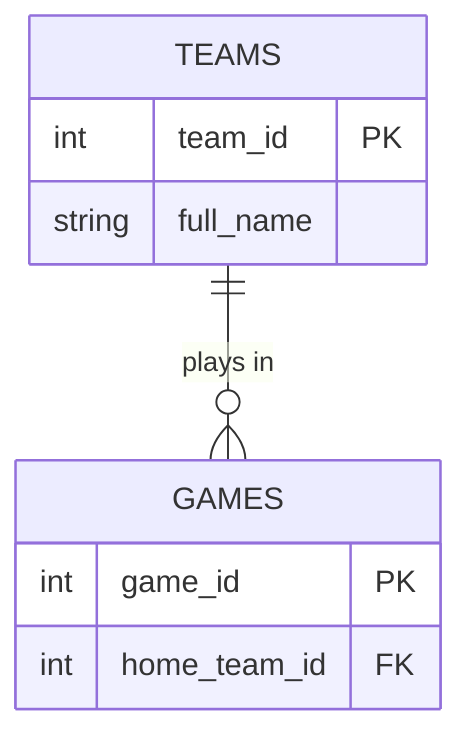

# Unit 3 — Database Design

**Database Applications Development · Medina County Career Center**

---

## How this unit works

This file is **read only** — a reference. You never type into it, and you never turn it in.

Each segment is its own lesson, with two files:

- **`unit3a_Walkthrough.md`** (and so on through `3e`) — the lesson. Read it on GitHub at the start of the segment. Not turned in.
- **`unit3a_lastname.md`** (and so on) — the turn-in. Download it, rename it with your last name, fill it in, commit and push. One file per segment.

Everything you turn in is typed. Diagrams are typed too — you'll write them in **Mermaid**, a short text format that GitHub turns into a picture automatically. No drawings, no photos, no paper.

**Five segments, about five class periods.** Very little SQL — this unit is about *designing* tables, not querying them. In Unit 4 you'll build the design you make here.

---

## What You'll Be Able To Do

1. Explain why storing the same fact in many places causes **update, insert, and delete problems**
2. Name the parts of a design — **entity, attribute, primary key, foreign key, schema**
3. Tell a **one-to-one**, **one-to-many**, and **many-to-many** relationship apart, and fix many-to-many with a **junction table**
4. Write an **ER diagram** in Mermaid
5. Take a flat table to **1NF, 2NF, and 3NF**, and say when *not* to
6. Name the four **levels of abstraction** — conceptual, logical, physical, view
7. Pick a **data model** (relational, document, graph, star, key-value…) that fits a client's situation, and say why
8. Name the four kinds of **design documentation** — ER diagram, data dictionary, workflow diagram, UML
9. Choose a **storage type** and **constraints** for a column
10. Design a small database with a partner and document it in a **data dictionary**

*State competencies: 8.1.2–8.1.8 · 2.8.4 · 5.1.3 · 1.1.7, 1.2.7*

---

## Practice Plan

| Segment | Est. | What it covers | Studio work | Turn in |
|:-:|:-:|---|---|---|
| **3a** | ≈1 period | Redundancy · the three anomalies · what normalization is for | Inspect `denormalized_demo.db` — count the repeats, find the planted mistakes, compare to the fixed version | `unit3a_lastname.md` |
| **3b** | ≈1 period | Keys · relationships · junction tables · ER diagrams | Classify relationships, then write your first Mermaid ERD | `unit3b_lastname.md` |
| **3c** | ≈1 period | 1NF → 2NF → 3NF · when to denormalize | Normalize the action-movie table in Google Sheets, paste the final tables into markdown | `unit3c_lastname.md`, plus your copy of the spreadsheet |
| **3d** | ≈1 period | Abstraction levels · choosing a data model · documentation types · storage types · constraints | Sort and match tasks, then six practice items | `unit3d_lastname.md` |
| **3e** | ≈1 period | Design a database with a partner | Entities, Mermaid ERD, data dictionary, constraints — the schema you build in Unit 4 | `unit3e_lastname.md` (one per pair) |

**Every segment ends the same way:** a short vocabulary block, then a partner check.

*Segments are chunks of content, not calendar days. A segment is finished when its work is finished.*

---

## What's in each segment

**3a** — Open `denormalized_demo.db`. One table, `games_flat`, has every team's city, state, conference and division typed into every single game row. You'll count how many times Cleveland shows up, find two typing mistakes hiding in the data, and explain in plain words what goes wrong when you try to update, add, or delete. Then you'll open the fixed version — two tables, `teams` and `games` — and see the same data with every fact stored once.

**3b** — Keys and relationships. Natural keys vs. made-up ID numbers, composite keys, and what a foreign key actually promises. You'll sort six real relationships into one-to-one, one-to-many, and many-to-many, then write an ER diagram in Mermaid for a school schedule. A copy-and-edit template is in the turn-in file.

**3c** — Normalization has three steps with names: 1NF, 2NF, 3NF. Each one fixes one specific problem. You'll take a table of action-movie characters through all three in a spreadsheet (`unit3_Normalization.xlsx` — open it in Google Sheets), then paste your final tables into the turn-in file. Ends with one question about when a designer *chooses* to break the rules.

**3d** — The describe-it segment. Short sort-and-match tasks covering everything the state outline names that we haven't hit yet: the four levels a design goes through, which kind of database fits which client, the four kinds of documentation, which storage type fits which column, and which constraint fixes which problem. Then six practice questions where you explain why the wrong answers are wrong.

**3e** — With a partner, pick one of three scenarios and design it: entities, an ER diagram, a data dictionary, and constraints. You have to agree on one design and turn in the same one. **This is the database you build in Unit 4** — so make it small and make it right.

---

## Files you'll use

| File | What it is |
|---|---|
| `unit3a_Walkthrough.md` … `unit3e_Walkthrough.md` | The lesson for each segment. Read first. |
| `unit3a_lastname.md` … `unit3e_lastname.md` | Rename and fill in. One per segment — these are what you turn in. |
| `unit3_Normalization.xlsx` | Segment 3c working file. Open in Google Sheets (File → Import). Share the link or export it back to `.xlsx` and commit it. |
| `datasets/denormalized_demo.db` | Segment 3a. Open in DB Browser for SQLite. |
| `unit3_Slides.md` | The short kickoff deck shown on day one. |

---

## Mermaid in one minute

Type this inside a markdown file, and GitHub shows a diagram:

````

````

The middle part of `||--o{` is the relationship. Read it left to right:

| Symbol | Means |
|---|---|
| `||` | exactly one |
| `o{` | zero or many |
| `|{` | one or many |
| `o|` | zero or one |

So `TEAMS ||--o{ GAMES` reads "one team, many games." That is the whole skill: you cannot type the line without deciding what kind of relationship it is.

You can preview before you push: **mermaid.live** renders the same code.

---

## Unit 3 Self-Check

Closed file. Can you do all ten?

- [ ] Give one example each of an update, insert, and delete anomaly
- [ ] Define entity, attribute, primary key, foreign key in one sentence each
- [ ] Explain the difference between a natural key and a surrogate key
- [ ] Say what a junction table is for and what its primary key usually is
- [ ] Write `||--o{` and say what it means
- [ ] State the one rule each of 1NF, 2NF, and 3NF adds
- [ ] Give one reason a designer would denormalize on purpose
- [ ] List conceptual, logical, physical, view — and what changes between them
- [ ] Given a client description, name a database model that fits and one reason
- [ ] Name the four kinds of design documentation
