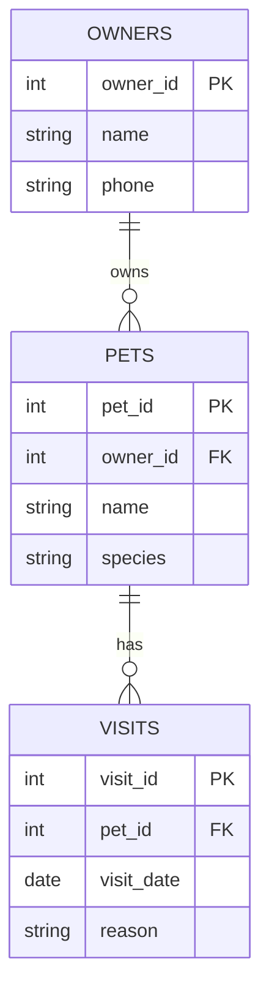

# Unit 3 Study Guide — Database Design

**This is the file to keep open while you work.** It's not the slides, and it's not something you turn in — it's where you look things up. Unit 2's guide was full of queries. This one is mostly vocabulary and worked examples, because Unit 3 is about *deciding what the tables should be*, not pulling data out of them.

The examples here are similar to your tasks, but they are **not** your tasks. The ER diagram below is not the school schedule, and the normalization example is not the action-movie table. Use them to see the *shape* of the work, then do your own.

Where there is SQL, it was actually run against `denormalized_demo.db`, so the numbers are real.

---

## Segment 3a — Redundancy and the Three Anomalies

### Redundancy

**Redundancy** means the same fact is stored in more than one place. In `games_flat`, every game row carries the home team's city, state, conference, and division — and the away team's too.

```sql
SELECT game_date, home_team, home_city, home_state, away_team, away_city
FROM   games_flat
LIMIT  3;
```
```
game_date   home_team              home_city       home_state       away_team           away_city
2025-10-21  Charlotte Hornets      Charlotte       North Carolina   Houston Rockets     Houston
2025-10-21  Milwaukee Bucks        Milwaukee       Wisconsin        Toronto Raptors     Toronto
2025-10-21  Oklahoma City Thunder  Oklahoma City   Oklahoma         Washington Wizards  Washington
```

260 games, 30 teams. "The Hornets play in Charlotte, North Carolina" is typed once per Hornets game instead of once, period.

### The three anomalies

An **anomaly** is something that goes wrong *because of how the table is designed*. Know all three by name — they show up on the quiz, on the exam, and in your 3a turn-in.

| Anomaly | What goes wrong | `games_flat` example |
|---|---|---|
| **Update anomaly** | A fact changes and you have to change it in many rows. Miss one and the table disagrees with itself. | The Cavaliers move. Thirty-plus rows need editing. |
| **Insert anomaly** | You have a fact to store but there is nowhere to put it until something else exists. | A new expansion team has a city, but `games_flat` only has rows for games. No game, no team. |
| **Delete anomaly** | You delete one thing and lose another thing by accident. | Delete every game a team played and the team's city, state, conference, and division vanish with them. |

A quick way to tell them apart: **update** = "fix it in 40 places," **insert** = "nowhere to put it yet," **delete** = "oops, that took something else with it."

### Finding the damage with DISTINCT

Redundancy doesn't just waste space. Every extra copy is one more place to make a typo. `SELECT DISTINCT` shows you how many *different* values a column really holds.

```sql
SELECT COUNT(DISTINCT home_team) AS names
FROM   games_flat;
```
```
names
31
```

There are 30 NBA teams. Thirty-one distinct names means one of them is spelled wrong somewhere. The database didn't complain — it just counted the misspelling as a 31st team. (Finding *which* row is your 3a task.)

The same idea catches the two counts that should match but don't:

```sql
SELECT COUNT(*) AS by_name
FROM   games_flat
WHERE  home_team = 'Cleveland Cavaliers' OR away_team = 'Cleveland Cavaliers';
```
```
by_name
32
```
```sql
SELECT COUNT(*) AS by_city
FROM   games_flat
WHERE  home_city = 'Cleveland' OR away_city = 'Cleveland';
```
```
by_city
33
```

Same question, two answers. The city count is right — 33 games have Cleveland in them. The name count is 32 because in one row the team name is misspelled, so `= 'Cleveland Cavaliers'` doesn't match it. Nothing warned you. That is what a redundant table does over time: every extra copy of a fact is one more place for a typo, and a typo makes queries quietly skip that row.

### The fix: one fact, one place

The same database has the fixed version: `teams` and `games`.

```
teams
team_id  full_name            city       state  conference  division
6        Cleveland Cavaliers  Cleveland  Ohio   East        Central

games
game_id  game_date   home_team_id  away_team_id  home_pts  away_pts
1        2025-10-21  4             11            131       127
```

The city is in **one row** of `teams`. Each game points at its teams by number. Now moving a team is a one-row edit, a new team can be added before it plays, and deleting games can't delete a team. Splitting tables so every fact lives in exactly one place is **normalization** — the subject of the whole unit.

### Joining the same table twice

To show both team *names* for a game, you need `teams` twice, with a different alias each time:

```sql
SELECT g.game_date, h.full_name AS home, a.full_name AS away
FROM   games g
JOIN   teams h ON h.team_id = g.home_team_id
JOIN   teams a ON a.team_id = g.away_team_id
LIMIT  3;
```
```
game_date   home                   away
2025-10-21  Charlotte Hornets      Houston Rockets
2025-10-21  Milwaukee Bucks        Toronto Raptors
2025-10-21  Oklahoma City Thunder  Washington Wizards
```

`h` and `a` are the *same* table. The first join follows `home_team_id`, the second follows `away_team_id`. Any time one table has two foreign keys into the same other table, this is the pattern — you'll see it again in the sports-league scenario in 3e.

---

## Segment 3b — Keys, Relationships, and ER Diagrams

### The four words

| Word | Means | Becomes |
|---|---|---|
| **Entity** | A thing you store information about — a pet, an owner, a visit | A table |
| **Attribute** | One piece of information about an entity — a pet's name, an owner's phone | A column |
| **Schema** | The whole structure: tables, columns, keys, and how they connect | The blueprint (not the data) |
| **Cardinality** | *Which kind* of relationship — one-to-one, one-to-many, many-to-many | The line in the ER diagram |

### Three kinds of primary key

| Kind | What it is | Example | Use it when… |
|---|---|---|---|
| **Natural key** | A real-world value that already identifies the row | `OH`, an ISBN, an email address | The value is guaranteed unique **and** never changes |
| **Surrogate key** | A made-up number the database assigns | `team_id = 6`, `pet_id = 40213` | Almost always. It means nothing, so it never has to change. |
| **Composite key** | Two or more columns together | `(player_id, season)` in `player_season_stats` | Junction tables, and any table where a *pair* is what's unique |

**Why names fail as keys:** two people can share a name (not unique), and people change their names (not stable). A name fails both tests, so it gets a surrogate ID instead.

### Foreign keys and referential integrity

A **foreign key** is a column that holds another table's primary key. `games.home_team_id` holds a `teams.team_id`.

The foreign key **promises** the value exists in the other table. When the database enforces that promise, it's **referential integrity**. Two things follow:

- Insert a game with `home_team_id = 99` and there's no team 99 → the database refuses.
- Delete team 6 while games still point at it → the designer picks one:

| Option | What happens |
|---|---|
| **Restrict** | Refuse the delete. Team 6 stays until its games are gone. |
| **Cascade** | Delete the games too. |
| **Set NULL** | Keep the games, blank out `home_team_id`. |

All three are legitimate. Which one is right depends on what the data means. (Would you want deleting a coach to delete the whole team? Probably not — restrict. Would you want deleting an order to delete its order lines? Yes — cascade.)

### Three kinds of relationship

| Kind | Example | Where the foreign key goes |
|---|---|---|
| **One-to-one** | a country and its capital | Either table |
| **One-to-many** | an owner and their pets | In the **many** table (`pets.owner_id`) |
| **Many-to-many** | songs and playlists | Can't be stored directly — needs a **junction table** |

One-to-many is by far the most common. The rule: **the foreign key always goes on the many side.** A pet knows its owner; an owner doesn't keep a list of pets.

How to decide which kind you have — ask the question both directions:

> Can one owner have many pets? **Yes.**
> Can one pet have many owners? **No** (in this design).
> → one-to-many, owner → pets.

> Can one song be on many playlists? **Yes.**
> Can one playlist hold many songs? **Yes.**
> → many-to-many. Junction table.

### Junction tables

A single cell can hold only one value, so "Rock Mix, Workout, Study" in a `playlists` column is exactly what 1NF forbids. The answer is a third table with one row per *pair*:

```
SONGS                 PLAYLIST_SONGS                 PLAYLISTS
song_id  PK           playlist_id  FK ┐ PK           playlist_id  PK
title                 song_id      FK ┘              name
artist                position
```

`PLAYLIST_SONGS` is the **junction table**. Its primary key is usually both foreign keys together — a composite key. It can carry attributes that belong to the pair (here, `position` — where the song sits in *that* playlist).

You've already used one: `roles` in `movies_small.db` is the junction between `movies` and `people`.

### Outside the relational model

Two other ways relationships get stored. Recognize them; you won't design with them.

| Model | How relationships work | Example |
|---|---|---|
| **Graph** (nodes and relationships) | People are *nodes*, FOLLOWS is an *edge*. The relationship is a first-class thing, no junction table. | Instagram's follow list; "friends of friends of friends" |
| **Key-value** | One key, one value, nothing else. To connect two things, you store the other key inside the value and your program follows it. | `session_8f3a → "ryan"` |

### ER diagrams in Mermaid

An **ER diagram** (entity-relationship diagram) shows entities as boxes, attributes inside, and relationships as lines. You type it, GitHub draws it.

Here is a small vet-clinic design — three entities, two one-to-many relationships:

````

````

Rendered on GitHub, that is three boxes with two crow's-foot lines.

**Reading a relationship line, left to right:** `OWNERS ||--o{ PETS` = one owner (`||`), zero or many pets (`o{`).

| Symbol | Means |
|---|---|
| `\|\|` | exactly one |
| `o\|` | zero or one |
| `\|{` | one or many |
| `o{` | zero or many |

The end with `{` is the **many** end — that's the crow's foot. You cannot type the line without deciding which side is the many side, and that decision *is* the skill.

**Inside the braces:** each line is `type name`, in that order, then an optional `PK` or `FK`. Types are labels only (`int`, `string`, `date`) — nothing checks them.

**Three things that break the diagram:**

| You typed | Problem |
|---|---|
| `owner_id int PK` | Name before type. Must be `int owner_id PK`. |
| `OWNERS ||--o{ PETS` with no `: "label"` | Mermaid requires a label. Any short text in quotes works. |
| An entity used on a line but never given `{ }` | Renders, but as an empty box — you probably forgot its attributes. |

Preview at **mermaid.live** before you push. If GitHub shows an error box instead of a picture, the first thing to check is the type/name order.

---

## Segment 3c — Normalization: 1NF, 2NF, 3NF

### The three rules

| Form | The one rule it adds | The problem it removes |
|---|---|---|
| **1NF** | One value per cell. One data type per column. Every table has a primary key. | Lists inside cells |
| **2NF** | Every non-key column depends on the **whole** primary key. | **Partial dependency** |
| **3NF** | Every non-key column depends on **nothing but** the primary key. | **Transitive dependency** |

You have to pass each one before the next. The line to remember: **"the key, the whole key, and nothing but the key."**

### A worked example: coffee shop orders

The action-movie table is your task. This is a different table with the same three problems, so you can see the procedure once before you do it yourself.

| Order | Customer | Customer_Phone | Items |
|---|---|---|---|
| 101 | Dana | 330-555-0101 | latte (2), scone (1) |
| 102 | Marcus | 330-555-0177 | drip coffee (1) |
| 103 | Dana | 330-555-0101 | latte (1), muffin (2), drip coffee (1) |

Latte costs 4.50, drip coffee 2.25, scone 3.00, muffin 3.25 — same price no matter who orders.

### 1NF — one value per cell

`Items` holds a whole list. You can't ask "how many lattes did we sell?" because the database sees one long string.

**Fix:** one item per row. Give each item its own quantity and price columns.

| Order | Item | Qty | Price | Customer | Customer_Phone |
|---|---|---|---|---|---|
| 101 | latte | 2 | 4.50 | Dana | 330-555-0101 |
| 101 | scone | 1 | 3.00 | Dana | 330-555-0101 |
| 102 | drip coffee | 1 | 2.25 | Marcus | 330-555-0177 |
| 103 | latte | 1 | 4.50 | Dana | 330-555-0101 |
| 103 | muffin | 2 | 3.25 | Dana | 330-555-0101 |
| 103 | drip coffee | 1 | 2.25 | Dana | 330-555-0101 |

`Order` alone can't be the key any more — order 101 has two rows. The key is **(Order, Item)**, a composite key. Each pair appears once.

Notice the table got *more* repetitive, not less. Dana's phone is now typed four times. That's expected: 1NF makes the redundancy visible so 2NF can remove it.

### 2NF — the whole key

For each non-key column, ask: **does it need both parts of the key, or just one?**

| Column | Depends on | Whole key? |
|---|---|---|
| Qty | Order **and** Item — 2 lattes on 101, 1 latte on 103 | yes |
| Price | Item only — a latte is 4.50 on every order | **no** |
| Customer | Order only — the item doesn't change who ordered | **no** |
| Customer_Phone | Order only | **no** |

Anything that depends on only *part* of the key is a **partial dependency**. 2NF forbids it.

**Fix:** move each group of columns into a table keyed by the part it actually depends on.

```
ORDERS                                  ITEMS                    ORDER_LINES
Order (PK)  Customer  Customer_Phone     Item (PK)     Price      Order (PK, FK)  Item (PK, FK)  Qty
101         Dana      330-555-0101       latte         4.50       101             latte          2
102         Marcus    330-555-0177       scone         3.00       101             scone          1
103         Dana      330-555-0101       drip coffee   2.25       102             drip coffee    1
                                         muffin        3.25       103             latte          1
```

Price is stored once per item. `ORDER_LINES` is a junction table between `ORDERS` and `ITEMS`, keyed by both foreign keys — exactly the 3b pattern.

### 3NF — nothing but the key

Look at `ORDERS`. Every column depends on `Order`, so it passes 2NF. But `Customer_Phone` doesn't really depend on *which order it is* — it depends on **who the customer is**. Dana's phone is the same on order 101 and order 103.

That's a **transitive dependency**: Order → Customer → Customer_Phone. The phone rides along on the customer.

Why it matters: Dana gets a new phone. Somebody updates order 103 and forgets 101. Now the database has two phone numbers for one person and no way to know which is right.

**Fix:** give the customer their own table.

```
CUSTOMERS                              ORDERS
Customer_ID (PK)  Name    Phone         Order (PK)  Customer_ID (FK)
1                 Dana    330-555-0101  101         1
2                 Marcus  330-555-0177  102         2
                                        103         1
```

Four tables total: `CUSTOMERS`, `ORDERS`, `ITEMS`, `ORDER_LINES`. Every fact is in exactly one place.

### Telling partial and transitive apart

Students mix these up constantly. The test:

| Dependency | Looks like | Only possible when… | Failed form |
|---|---|---|---|
| **Partial** | Column depends on *part* of a composite key | The key has two or more columns | 2NF |
| **Transitive** | Column depends on *another non-key column* | Any table | 3NF |

If the table has a single-column primary key, it cannot have a partial dependency. Skip straight to looking for transitive ones.

### When to stop, and when to break the rules

**Stop at 3NF.** Higher forms exist (BCNF, 4NF, 5NF). For this class and both exams, 3NF is the target.

**Denormalization** is putting redundancy back **on purpose**. The coffee shop might copy `Price` into `ORDER_LINES` so a receipt doesn't need a join — and so the receipt still shows what the customer *paid* even if the price changes next month. It's a trade: faster reads (and sometimes a real business reason), in exchange for accepting an update anomaly.

Where it's normal: reporting databases, data warehouses, anything read constantly and changed almost never.

The difference between a badly designed table and a denormalized one is whether somebody **decided**.

---

## Segment 3d — Design Vocabulary

### Four levels of abstraction

A design goes from vague to exact. Each level adds detail the one before it left out.

| Level | What's in it | What it looks like | Which unit |
|---|---|---|---|
| **Conceptual** | Entities and relationships only. No columns. | "Owners have pets. Pets have visits." Boxes and lines. | 3 |
| **Logical** | Tables, columns, keys, relationships. No data types or storage details. | The Mermaid ERD you wrote in 3b | 3 |
| **Physical** | Data types, indexes, constraints, the actual DBMS and file. | `pet_id INTEGER PRIMARY KEY`, an index on `name`, a SQLite file | 4 |
| **View** | The slice one user or role is allowed to see. | A vet sees their own appointments, not the billing table | 5 |

The tell for each: **no columns** = conceptual. **Columns but no types** = logical. **Types, indexes, files** = physical. **"What this user sees"** = view.

### Picking a data model

Given a client's situation, which kind of database fits? Learn the first five well enough to choose between them with a reason. Be able to say one sentence about each of the other six.

**The five you choose between:**

| Model | What it is | The client says… |
|---|---|---|
| **Relational** | Tables, keys, joins. This whole course. | "Nothing can ever be out of sync." Strict rules, lots of linked records. |
| **Document** | Each record is a self-contained document (usually JSON); records can have different fields. | "Every product has completely different attributes." |
| **Graph** | Nodes and edges. Relationships are the point. | "Who is connected to whom, several hops out." |
| **Star** (data warehouse) | One big fact table surrounded by dimension tables. Denormalized on purpose. | "Totals by region by month, ten years of history." |
| **Key-value** | One key, one value. Nothing else. | "Look up one thing by ID, millions of times a second." |

**The six to recognize:**

| Model | One sentence |
|---|---|
| **Hierarchical** | A tree — every record has exactly one parent (folders on a drive, an org chart). |
| **Object-oriented** | Stores program objects as-is, no tables, no joins. |
| **Object-relational** | A relational database that also understands objects and custom types (PostgreSQL). |
| **Entity-attribute-value** | One row per (thing, attribute, value) triple — for sparse data with thousands of possible attributes, like medical records. |
| **Multidimensional** | Data as a cube with several dimensions, for pivoting and analysis (OLAP). |
| **Multivalue** | A field can legally hold a list — the thing 1NF forbids, done on purpose (Pick, UniVerse). |

How to answer a "pick the model" question: find the **one phrase** in the client's description that rules the others out. "Nothing out of sync" → relational. "Completely different attributes" → document. "Hops" or "connected to" → graph. "Totals by … by …" over history → star. "One lookup, huge volume" → key-value.

### Four kinds of documentation

| Document | What it shows | Who reads it | You make it in… |
|---|---|---|---|
| **ER diagram** | Entities, keys, relationships | The database designer | 3b, 3e |
| **Data dictionary** | Every table and column: type, key, required or not, what it means | Everyone who writes queries | 3e |
| **Workflow diagram** | The steps a process goes through, start to finish (a flowchart) | The people running the process | recognize only |
| **UML class diagram** | The program's classes, their fields and methods | The programmers | recognize only |

The two that get confused: an **ER diagram** has entities and crow's feet; a **UML class diagram** has classes with *methods* (things the code can do). If you see a verb like `checkOut()` inside a box, it's UML.

A **data dictionary** is just a table, one row per column:

| Table | Column | Type | Key | Required? | Description |
|---|---|---|---|---|---|
| pets | pet_id | INTEGER | PK | yes | Surrogate ID for the pet |
| pets | owner_id | INTEGER | FK → owners | yes | The owner this pet belongs to |
| pets | name | TEXT | | yes | The pet's name |
| pets | species | TEXT | | yes | dog, cat, rabbit, etc. |
| visits | visit_date | DATE | | yes | Day the pet was seen |

### Storage types

Families only — not the SQL Server sizes.

| Family | Holds | Examples |
|---|---|---|
| **INTEGER** | Whole numbers | points, quantity, any ID |
| **REAL** | Decimals | price, weight, a rating |
| **TEXT** | Characters | names, addresses, anything you'd never do math on |
| **DATE / TIME** | Dates and times | visit_date, created_at |
| **BOOLEAN** | True / false | is_active, is_paid |

**The rule that catches people: if you'd never do math on it, it's TEXT.** Phone numbers and zip codes *look* like numbers but aren't:

- A zip code can start with 0. As a number, `03104` becomes `3104` and the leading zero is gone.
- A phone number has dashes, parentheses, sometimes a country code.
- Nobody ever adds two phone numbers together.

Same for student IDs, product codes, and credit card numbers. If the only thing you'll ever do is look it up or display it, TEXT.

SQLite is loose about types — it stores dates as TEXT and booleans as 0/1 — but the *design decision* is the same in every database.

### Constraints as design decisions

A **constraint** is a rule the database enforces so bad data can't get in. You'll write them in SQL in Unit 4. Now, you just pick the right one.

| The problem | The constraint | What it does |
|---|---|---|
| Two rows with the same email | `UNIQUE` | No two rows may share a value in this column |
| A visit saved with no date | `NOT NULL` | The column can't be empty |
| Two rows that are the same pet | `PRIMARY KEY` | Unique **and** not null — identifies the row |
| A visit pointing at pet 99, which doesn't exist | `FOREIGN KEY` | The value must exist in the other table |
| A weight of −5 | `CHECK` | A custom rule you write: `CHECK (weight > 0)` |

`PRIMARY KEY` vs `UNIQUE`: a table gets exactly one primary key, but can have as many `UNIQUE` columns as it needs. A primary key can never be NULL; a `UNIQUE` column can be, unless you also say `NOT NULL`.

`CHECK` is the catch-all. If the rule is "this value has to make sense" — positive, in a range, one of a short list, not equal to another column — it's a `CHECK`.

### Practice items — how they're graded

The six multiple-choice items ask you to pick the answer **and** write one sentence per wrong option saying why it's wrong. That second step is where the points are. Guessing right earns little; knowing why the other three are false is what the exam actually tests.

A useful habit: for each wrong option, name the *thing it actually is*. "C is a delete anomaly, not an update anomaly — nothing was deleted here."

---

## Segment 3e — Design Your Own

This segment is 3a through 3d applied once, with a partner. There's nothing new to learn — this section is a checklist of what the turn-in needs and the traps in each scenario.

### The seven steps, and what each one produces

| Step | Ask yourself | You write down |
|---|---|---|
| 1. Entities | What are the *things*? (The nouns in the scenario.) | One table per thing, and what one row is: "one row = one checkout" |
| 2. Attributes | What do I need to know about each thing? | 3–6 columns per table. Only what the scenario needs. |
| 3. Primary keys | How is each row identified? | A surrogate ID for every table; a composite key for junction tables |
| 4. Relationships | For each pair that connects: which kind? | One-to-many → FK on the many side. Many-to-many → junction table. |
| 5. ER diagram | Does every entity, key, and line appear? | Mermaid, crow's foot on the many side, previewed on mermaid.live |
| 6. Data dictionary | Could someone build this without asking me anything? | One row per column: type, key, required?, description |
| 7. Constraints | What can *never* be true in this data? | At least three beyond primary keys, each stated in English and named |

### The trap in each scenario

Every scenario has one thing that's easy to get wrong.

| Scenario | The trap | What to do |
|---|---|---|
| **School club tracker** | Students ↔ clubs is many-to-many. | Junction table (`MEMBERSHIPS`), keyed by `(student_id, club_id)`. Advisors are teachers — decide whether that's its own table or a column, and be able to say why. |
| **Small library** | Books ↔ authors is many-to-many. "Smith, Jones" in one author cell fails 1NF. | Junction table (`BOOK_AUTHORS`). A checkout is its own entity — it has dates that belong to neither the book nor the member alone. |
| **Youth sports league** | A game points at `teams` **twice** — home and away. | Two foreign keys into the same table (`home_team_id`, `away_team_id`), like `denormalized_demo.db`. Add `CHECK (home_team_id <> away_team_id)`. |

### Before you commit

Run the design through this. Every box checked means it's almost certainly 3NF.

- [ ] Every table has a primary key
- [ ] Every many-to-many goes through a junction table
- [ ] No cell holds a list
- [ ] No fact is stored in two places — the coach's name is in `coaches`, not typed into `teams`
- [ ] Every foreign key points at a primary key that exists in your diagram

Then say which normal form you reached and **why**, in one sentence. "No lists, single-column keys except the junction table, and nothing depends on a non-key column — 3NF."

### Settling a disagreement

The turn-in asks what you disagreed on and how you settled it. The way to settle one: **say what each option costs.**

> "If the coach is just a text column in `teams`, renaming a coach means editing every team row."

That's an update anomaly, and now you both know which way to go. A disagreement settled by "we picked mine" earns less than one settled by naming the anomaly.

---

## Quick-reference: every term in this unit

| Term | Means |
|---|---|
| **Redundancy** | The same fact stored in more than one place |
| **Update / insert / delete anomaly** | Fix it everywhere / nowhere to put it yet / lost something by accident |
| **Normalization** | Splitting tables so every fact is stored once |
| **Denormalization** | Putting redundancy back *on purpose* — usually for faster reads |
| **Entity / attribute** | A thing you store (→ table) / one fact about it (→ column) |
| **Schema** | The whole structure — tables, columns, keys, relationships — not the data |
| **Primary key** | Identifies one row. Unique and never NULL. |
| **Natural / surrogate / composite key** | Real-world value / made-up number / two or more columns together |
| **Foreign key** | A column holding another table's primary key |
| **Referential integrity** | The database enforcing that every foreign key points at a row that exists |
| **Restrict / cascade / set NULL** | The three things a delete can do when foreign keys point at the row |
| **Cardinality** | Which kind of relationship: 1:1, 1:many, many:many |
| **Junction table** | The third table that stores a many-to-many, one row per pair |
| **ER diagram** | Entities, keys, and relationship lines — written in Mermaid here |
| `\|\|` `o\|` `\|{` `o{` | exactly one / zero or one / one or many / zero or many |
| **1NF / 2NF / 3NF** | One value per cell + a key / whole key / nothing but the key |
| **Partial dependency** | Depends on *part* of a composite key — fails 2NF |
| **Transitive dependency** | Depends on another *non-key* column — fails 3NF |
| **Conceptual / logical / physical / view** | No columns / columns, no types / types and storage / what one user sees |
| **Relational / document / graph / star / key-value** | Strict linked tables / flexible JSON records / nodes and edges / fact + dimensions / one key, one value |
| **ER diagram / data dictionary / workflow diagram / UML** | Structure / every column explained / a process flowchart / the program's classes |
| **INTEGER / REAL / TEXT / DATE / BOOLEAN** | Whole numbers / decimals / characters / dates / true-false |
| `NOT NULL` `UNIQUE` `PRIMARY KEY` `FOREIGN KEY` `CHECK` | Required / no repeats / identifies the row / must exist elsewhere / custom rule |

**The one sentence for the whole unit:** every fact lives in exactly one table, every table has a key, and tables connect through foreign keys — the key, the whole key, and nothing but the key.
