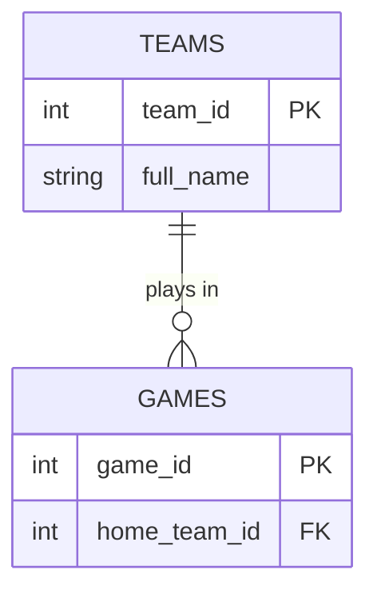

# Unit 3b Walkthrough — Keys and Relationships

**Read this first. Then open `unit3b_lastname.md` and do the work.**

---

## What you're doing today

Yesterday you saw that splitting one big table into smaller ones fixes redundancy. But the smaller tables have to stay connected, or you can't answer questions across them. Keys and relationships are how they connect. Today you learn the vocabulary, sort some real relationships, and write your first ER diagram — typed, not drawn.

---

## The vocabulary

An **entity** is a thing you store information about — a team, a student, a game. Each entity becomes a table.

An **attribute** is one piece of information about an entity — a team's city, a student's grade level. Each attribute becomes a column.

The **schema** is the whole structure: the tables, their columns, their keys, and how they connect. It's the blueprint, not the data.

---

## Primary keys — three flavors

A **primary key** identifies one row. You've been using them since Unit 1. There are three kinds:

**Natural key** — a real-world value that already identifies the row. A state's abbreviation (`OH`), a book's ISBN, an email address. It means something outside the database.

**Surrogate key** — a made-up number the database assigns. `team_id = 6`, `student_id = 40213`. It means nothing, and that's the point: it never changes and there's never a duplicate.

**Composite key** — two or more columns together. In `nba_5seasons.db`, `player_season_stats` is keyed by `(player_id, season)` — a player has many seasons, and a season has many players, but each player-season pair appears once.

Most tables you design get a surrogate key. Use a natural key only when the real-world value is guaranteed unique and never changes. Names fail both tests.

---

## Foreign keys — a promise

A **foreign key** is a column that holds another table's primary key. `games.home_team_id` holds a `teams.team_id`.

The foreign key **promises** that the value exists in the other table. When the database enforces that promise, it's called **referential integrity**. Two things follow from it:

- Insert a game with `home_team_id = 99` when there is no team 99? The database refuses.
- Delete team 6 while games still point at it? The designer chooses what happens. **Restrict** — refuse the delete. **Cascade** — delete the games too. Or set the foreign key to NULL. All three are legitimate; the choice depends on what the data means.

---

## Relationships — three kinds

Every relationship between two entities is one of these:

| Kind | Example | How it's stored |
|---|---|---|
| **One-to-one** | a country and its capital | a foreign key in either table |
| **One-to-many** | a team and its games | a foreign key in the *many* table |
| **Many-to-many** | students and courses | can't be stored directly — see below |

The word for "which kind" is **cardinality**.

One-to-many is by far the most common. The rule for where the foreign key goes: **always in the many side**. A game knows its team; a team doesn't list its games.

---

## Many-to-many needs a junction table

A student takes many courses. A course has many students. Neither table can hold the other's key, because a single cell can only hold one value — and "Math, Science, Art" in one cell is exactly the kind of thing you'll learn to fix in 3c.

The answer is a third table:

```
STUDENTS            ENROLLMENTS                  COURSES
student_id  PK      student_id  FK  ┐ PK         course_id  PK
name                course_id   FK  ┘            title
                    grade
```

`ENROLLMENTS` is a **junction table**. One row per student-course *pair*. Its primary key is usually both foreign keys together — a composite key. It can also carry attributes that belong to the pair, like the grade the student got in that course.

You saw one already: `roles` in `movies_small.db` is the junction between `movies` and `people`.

---

## Outside the relational model

The state outline says relationships can also be described in two other ways. You need to recognize them, not design with them.

**Nodes and relationships** — how a **graph database** stores things. Instagram's follow list is people as *nodes* and FOLLOWS as *edges* between them. No junction table; the relationship is a first-class thing. Great for "friends of friends of friends."

**Key / value** — the simplest store there is. One key, one value: `session_8f3a → "ryan"`. There is no relationship structure at all. If you need to connect two things, you store the other key inside the value and your program follows it.

---

## ER diagrams — typed, not drawn

An **ER diagram** (entity-relationship diagram) shows entities as boxes, attributes inside them, and relationships as lines between them. Every database design starts with one.

You'll write yours in **Mermaid**, a text format GitHub renders as a picture. Type this in a markdown file:

````

````

And GitHub shows two boxes with a line between them.

The relationship line is the important part. `TEAMS ||--o{ GAMES` reads left to right: **one** team (`||`), **zero or many** games (`o{`). The symbols:

| Symbol | Means |
|---|---|
| `||` | exactly one |
| `o|` | zero or one |
| `|{` | one or many |
| `o{` | zero or many |

The end with the `{` is the "many" end — it's drawn as a crow's foot. You cannot type the line without deciding which side is the many side, which is the whole skill.

Inside the braces, each attribute is `type name`, in that order, with an optional `PK` or `FK` after it. Types are just labels — `int`, `string`, `date` — nothing checks them.

**Preview before you push:** paste your code into **mermaid.live**. If GitHub shows an error box instead of a diagram, the usual cause is an attribute line with the name before the type.

---

## Now do the work

Open `unit3b_lastname.md`. Classify four primary keys, answer two foreign-key questions, sort six relationships, then write a Mermaid ERD for a school schedule — four entities, one of them a junction table. A working example is in the file to copy from. Check that your diagram renders on GitHub before you call it done.
