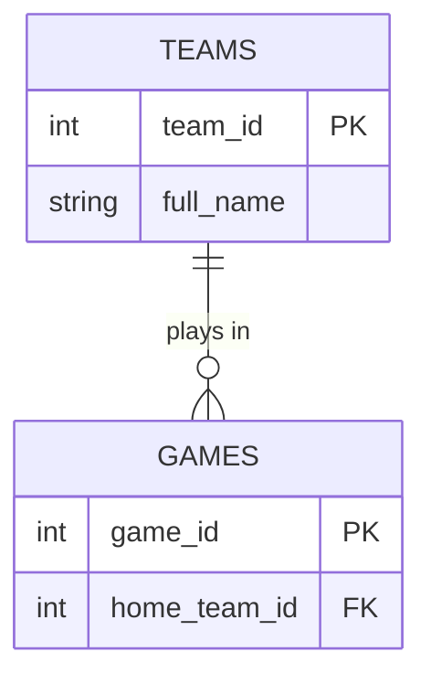

# Unit 3b Walkthrough — Keys and Relationships

**Read this first. Then open `unit3b_lastname.md` and do the work.**

We might watch this video in class on relationships: **Everything you NEED TO KNOW about Relationships** - https://www.youtube.com/watch?v=WOX9g1s43-g

---

## What you're doing today

In 3a you saw that splitting one big table into smaller ones fixes redundancy. But the smaller tables have to stay connected, or you can't answer questions across them. Keys and relationships are how they connect. Today you learn the vocabulary, sort some real relationships, and write your first entity-relationship (ER) diagram — typed, not drawn.

---

## The vocabulary

An **entity** is a thing you store information about — a team, a student, a game. Each entity becomes a table.

An **attribute** is one piece of information about an entity — a team's city, a student's grade level. Each attribute becomes a column.

The **schema** is the whole structure: the tables, their columns, their keys, and how they connect. It's the blueprint, not the data.

---

## Primary keys — three types

A **primary key** identifies one row. You've been using them since Unit 1. There are three kinds:

**Natural key** — a real-world value that already identifies the row. A state's abbreviation (`OH`), a book's ISBN, an email address. It means something outside the database.

**Surrogate key** — a made-up number the database assigns. `team_id = 6`, `student_id = 40213`. It means nothing, and that's the point: it never changes and there's never a duplicate.

**Composite key** — two or more columns together. In `nba_5seasons.db`, `player_season_stats` is keyed by `(player_id, season)` — a player has many seasons, and a season has many players, but each player-season pair appears once.

Most tables you design get a surrogate key. Use a natural key only when the real-world value is guaranteed unique and never changes (uncommon!).

---

## Foreign keys 

A **foreign key** is a column that holds another table's primary key. `games.home_team_id` holds a `teams.team_id`.

The foreign key **promises** that the value exists in the other table. When the database enforces that promise, it's called **referential integrity**. Two things follow from it:

- Insert a game with `home_team_id = 99` when there is no team 99? The database refuses.
- Delete team 6 while games still point at it? The designer chooses what happens. **Restrict** — refuse the delete. **Cascade** — delete the games too. Or set the foreign key to NULL. All three are legitimate options.

---

## Relationships — three kinds

Every relationship between two tables is one of these:

| Kind             | What it means                                                                                                               | Example                   | How it's stored                     |
| ---------------- | --------------------------------------------------------------------------------------------------------------------------- | ------------------------- | ----------------------------------- |
| **One-to-one**   | One record in Table A is related to **one** record in Table B, and vice versa.                                              | A country and its capital | A foreign key in either table       |
| **One-to-many**  | One record in Table A can be related to **many** records in Table B, but each B record is related to only one A record.     | A team and its games      | A foreign key in the **many** table |
| **Many-to-many** | One record in Table A can be related to **many** records in Table B, and one B record can be related to **many** A records. | Students and courses      | Requires a **junction table**       |

The word for **how many records can be related to each other** is **cardinality**.

**One-to-many is by far the most common relationship.**

### Where does the foreign key go?

For a **one-to-many** relationship, the rule is:

> **The foreign key always goes in the "many" table.**

For example, a team can have many games, so `team_id` goes in the `games` table:

```text
teams                    games
---------                ----------
team_id                  game_id
name                     team_id  ← FK
                         game_date
                         pts
```

Each game knows which team it belongs to. The team does not need to store a list of all its games.

For a **one-to-one** relationship, there is no "many" side, so the foreign key can be placed in either table. In practice, you choose the table where it makes the most sense.

For a **many-to-many** relationship, neither table can hold the foreign key by itself. Instead, a third **junction table** holds the foreign keys from both tables.


---

## Many-to-many needs a junction table

A student takes many courses. A course has many students.

Try to store that with a foreign key the way you did for one-to-many. Put a `course_id` column in `STUDENTS`? A cell holds one value, and a student has three courses — which one do you write? You'd end up typing "Math, Science, Art" into one cell, which is exactly what 3c teaches you not to do. Put a `student_id` in `COURSES`? Same problem — a course has thirty students.

So the foreign keys can't go in either table. They go in a **third table**, one row per student-course pair:

```
STUDENTS                ENROLLMENTS                     COURSES
student_id  PK          student_id  FK  ┐               course_id  PK
name                    course_id   FK  ┘ PK together   title
                        grade
```

```
ENROLLMENTS
student_id  course_id  grade
40213       101        A
40213       102        B
40213       105        A
40214       101        B
```

Student 40213 takes three courses, so they get three rows. Course 101 has two students, so it shows up twice. Every cell still holds one value.

`ENROLLMENTS` is a **junction table**. Both of its foreign keys together make the primary key — a composite key — because the *pair* is what's unique: a student can't be enrolled in the same course twice. A junction table can also carry attributes that belong to the pair, like the grade the student got in *that* course.

You saw one already: `roles` in `movies_small.db` is the junction between `movies` and `people`..

---

## Outside the relational model

The state outline says relationships can also be described in two other ways. You need to recognize them, not design with them.

**Nodes and relationships** — how a **graph database** stores things. Instagram's follow list is people as *nodes* and FOLLOWS as *edges* between them. No junction table; the relationship is a first-class thing. Great for "friends of friends of friends."

**Key / value** — the simplest store there is. One key, one value: `session_8f3a → "ryan"`. There is no relationship structure at all. If you need to connect two things, you store the other key inside the value and your program follows it.

---

## ER diagrams — typed, not drawn

An **ER diagram** (entity-relationship diagram) shows entities as boxes, attributes inside them, and relationships as lines between them. Every database design starts with one.

You'll write yours in **Mermaid**, a text format GitHub renders as a picture. Type this in a markdown file:

````

````

And GitHub shows two boxes with a line between them.

The relationship line is the important part. `TEAMS ||--o{ GAMES` reads left to right: **one** team (`||`), **zero or many** games (`o{`). The symbols:

| Symbol | Means |
|---|---|
| `||` | exactly one |
| `o|` | zero or one |
| `|{` | one or many |
| `o{` | zero or many |

The end with the `{` is the "many" end — it's drawn as a crow's foot. You cannot type the line without deciding which side is the many side, which is the whole skill.

Inside the braces, each attribute is `type name`, in that order, with an optional `PK` or `FK` after it. Types are just labels — `int`, `string`, `date` — nothing checks them.

**Preview before you push:** paste your code into **mermaid.live**. If GitHub shows an error box instead of a diagram, the usual cause is an attribute line with the name before the type.

---

## Now do the work

Open `unit3b_lastname.md`. Classify four primary keys, answer two foreign-key questions, sort six relationships, then write a Mermaid ERD for a school schedule — four entities, one of them a junction table. A working example is in the file to copy from. Check that your diagram renders on GitHub before you call it done.
