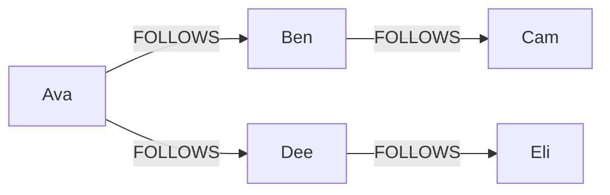
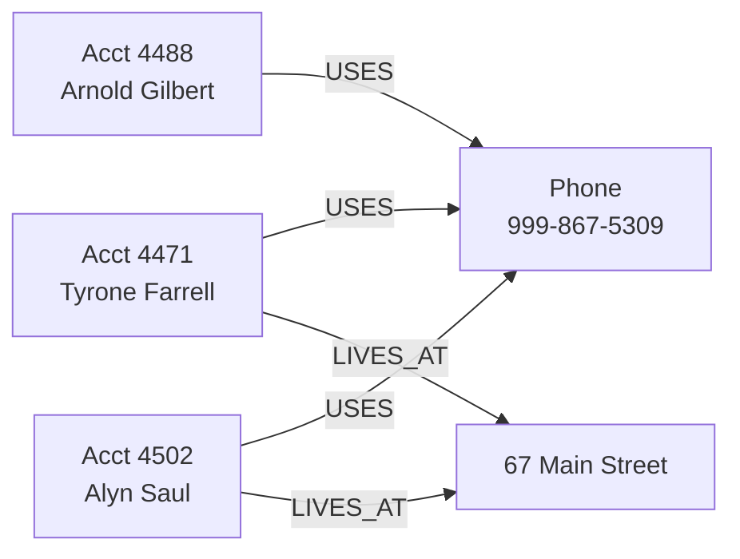
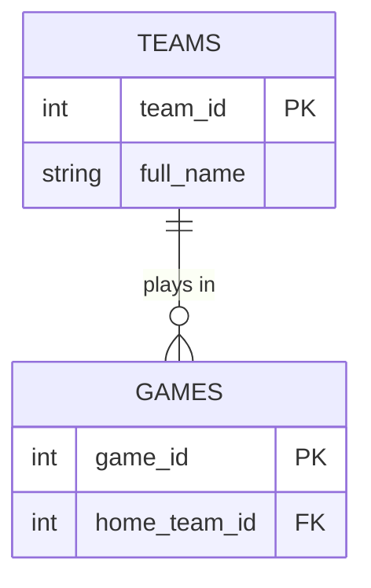
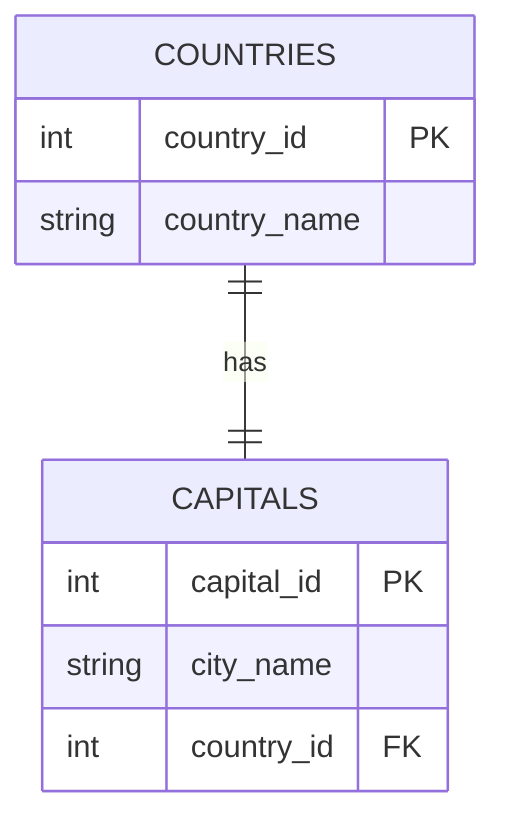
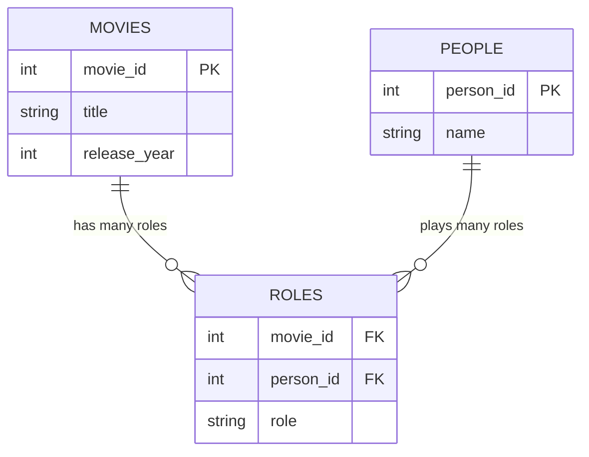
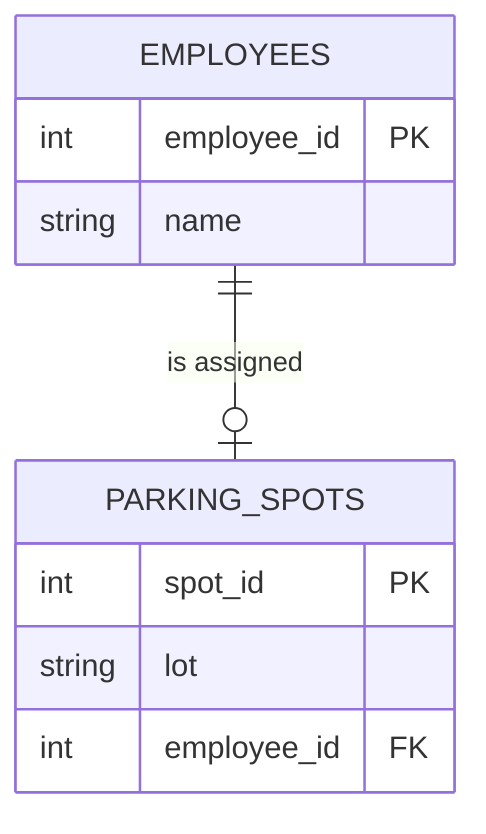

# Unit 3b Walkthrough — Keys and Relationships

**Read this first. Then open `unit3b_lastname.md` and do the work.**

We might watch this video in class on relationships: **Everything you NEED TO KNOW about Relationships** - https://www.youtube.com/watch?v=WOX9g1s43-g

---

## What you're doing today

In 3a you saw that splitting one big table into smaller ones fixes redundancy. But the smaller tables have to stay connected, or you can't answer questions across them. Keys and relationships are how they connect. Today you learn the vocabulary, sort some real relationships, and write your first entity-relationship (ER) diagram — typed, not drawn.

---

## The vocabulary

An **entity** is a thing you store information about — a team, a student, a game. Each entity becomes a table.

An **attribute** is one piece of information about an entity — a team's city, a student's grade level. Each attribute becomes a column.

The **schema** is the whole structure: the tables, their columns, their keys, and how they connect. It's the blueprint, not the data.

---

## Primary keys — three types

A **primary key** identifies one row. You've been using them since Unit 1. There are three kinds:

**Natural key** — a real-world value that already identifies the row. A state's abbreviation (`OH`), a book's ISBN, an email address. It means something outside the database.

**Surrogate key** — a made-up number the database assigns. `team_id = 6`, `student_id = 40213`. It means nothing, and that's the point: it never changes and there's never a duplicate.

**Composite key** — two or more columns together. In `nba_5seasons.db`, `player_season_stats` is keyed by `(player_id, season)` — a player has many seasons, and a season has many players, but each player-season pair appears once.

Most tables you design get a surrogate key. Use a natural key only when the real-world value is guaranteed unique and never changes (uncommon!).

---

## Foreign keys 

A **foreign key** is a column that holds another table's primary key. `games.home_team_id` holds a `teams.team_id`.

The foreign key **promises** that the value exists in the other table. When the database enforces that promise, it's called **referential integrity**. Two things follow from it:

- Insert a game with `home_team_id = 99` when there is no team 99? The database refuses.
- Delete team 6 while games still point at it? The designer chooses what happens. **Restrict** — refuse the delete. **Cascade** — delete the games too. Or set the foreign key to NULL. All three are legitimate options.
- An important note: the foreign key column name, in this case `games.home_team_id` which is referencing the `home_team_id` column or field, does not have to be the same name as the primary key it is referencing, which in this case is the `team_id` column in the `teams` table.  The schema is what you use to set the relationship up, and the column names don't have to match. 

---

## Relationships — three kinds

Every relationship between two tables is one of these:

| Kind             | What it means                                                                                                               | Example                   | How it's stored                     |
| ---------------- | --------------------------------------------------------------------------------------------------------------------------- | ------------------------- | ----------------------------------- |
| **One-to-one**   | One record in Table A is related to **one** record in Table B, and vice versa.                                              | A country and its capital | A foreign key in either table       |
| **One-to-many**  | One record in Table A can be related to **many** records in Table B, but each B record is related to only one A record.     | A team and its games      | A foreign key in the **many** table |
| **Many-to-many** | One record in Table A can be related to **many** records in Table B, and one B record can be related to **many** A records. | Students and courses      | Requires a **junction table**       |

The word for **how many records can be related to each other** is **cardinality**.

**One-to-many is by far the most common relationship.**

### Where does the foreign key go?

For a **one-to-many** relationship, the rule is:

> **The foreign key always goes in the "many" table.**

For example, a team can have many games, so `team_id` goes in the `games` table:

```text
teams                    games
---------                ----------
team_id                  game_id
name                     team_id  ← FK
                         game_date
                         pts
```

Each game knows which team it belongs to. The team does not need to store a list of all its games.

For a **one-to-one** relationship, there is no "many" side, so the foreign key can be placed in either table. In practice, you choose the table where it makes the most sense.

For a **many-to-many** relationship, neither table can hold the foreign key by itself. Instead, a third **junction table** holds the foreign keys from both tables.


---
## Many-to-many needs a junction table

A student takes many courses. A course has many students.

Try storing that with a foreign key the way you did for one-to-many. Put a `course_id` column in `STUDENTS`? A cell holds one value, and a student has three courses — which one do you write? You'd end up typing "Math, Science, Art" into one cell, which is exactly what an upcoming lesson teaches you not to do. Put a `student_id` in `COURSES`? Same problem — a course has thirty students.

So the foreign keys can't go in either table. They go in a third table, with one row per student-course pair.

**The design.** This shows the three tables and what columns each one has. No data yet — just the column names and which ones are keys.

```
STUDENTS              ENROLLMENTS (Junction Table)         COURSES
----------            ----------                           -------------
student_id  PK        student_id  FK                       course_id  PK
name                  course_id   FK                       title
                      grade
```

`ENROLLMENTS` sits between the other two. Its `student_id` points back to a row in `STUDENTS`, and its `course_id` points to a row in `COURSES`.

**The data.** Now the same `ENROLLMENTS` table with actual rows in it. These are the columns from the design above, filled in.

```
ENROLLMENTS
student_id   course_id   grade
---------------------------------
40213        101         A
40213        102         B
40213        105         A
40214        101         B
```

Read it a row at a time. Row one says student 40213 is enrolled in course 101 and earned an A.

Student 40213 appears three times because they take three courses. Course 101 appears twice because two students are in it. Every cell still holds exactly one value — that's the point.

`ENROLLMENTS` is a **junction table**: a table whose job is to connect two other tables.

Its primary key is `student_id` and `course_id` together, not either one alone. Neither works by itself — 40213 shows up three times, and 101 shows up twice. It's the *pair* that's unique, because a student can't enroll in the same course twice. A primary key made of two or more columns is called a **composite key**.

A junction table can also carry columns that belong to the pairing itself. `grade` is one: it isn't a fact about the student and it isn't a fact about the course, it's a fact about that student *in* that course.

--- 

## An example you've seen before, from the movies database

You've already seen a junction table. In `movies_small.db`, the `roles` table is the junction between `movies` and `people`.

A movie has many people working on it. A person works on many movies. Same many-to-many problem, same solution.

**The design.** Four tables. Column names only — no data yet.

```
movies                    roles                     people
-----------------         -----------------         -----------------
movie_id      PK          movie_id      FK          person_id   PK
title                     person_id     FK          name
release_year              role                      birth_year
runtime_minutes           character                 death_year
genres                                              profession

ratings
-----------------
movie_id      PK, FK
avg_rating
num_votes
```

---

## Outside the relational model

Two other kinds of databases store relationships differently. You need to **recognize** them, not design with them.

### Key / value

The simplest store there is. Each piece of data is saved under one unique **key**, and you get it back only by asking for that key. The database never looks inside the **value**. Examples: **Redis**, **DynamoDB**.

| Key | Value | Used for |
|---|---|---|
| `session:8f3a91` | `"user:1042"` | Remembering who is logged in |
| `cart:user:1042` | `{"items": [{"sku": "MUG-01", "qty": 1}]}` | A shopping cart |
| `views:video:5521` | `48213` | A view counter |

There are no foreign keys and no JOINs. To connect two things, you store one key inside another value, and your program does a second lookup:

```
GET session:8f3a91   →  "user:1042"
GET user:1042        →  {"name": "Ryan"}
```

**Good at:** very fast lookups by ID. **Bad at:** searching, like "find every cart with a mug in it."

### Nodes and relationships

This is how a **graph database** (like **Neo4j**) stores data. **Nodes** are the things, and **relationships** (also called **edges**) are the connections between them. There's no junction table because the relationship is stored directly.


```mermaid
graph LR
    Ava -->|FOLLOWS| Ben
    Ava -->|FOLLOWS| Dee
    Ben -->|FOLLOWS| Cam
    Dee -->|FOLLOWS| Eli
```

Graphs are good at questions about paths, like "who is two steps away from Ava?":

```cypher
MATCH (a:Person {name: "Ava"})-[:FOLLOWS]->()-[:FOLLOWS]->(fof)
RETURN fof.name;   // Cam, Eli
```

In SQL, every extra step would be another JOIN. In a graph, you just follow more arrows.

**Example: catching fraud.** A bank stores accounts, phone numbers, and addresses as nodes. Three accounts are opened under three different names. On their own, each account looks normal. But in the graph, all three connect to the same phone number, and two of them share an address:


```mermaid
graph LR
    A1["Acct 4471<br/>Tyrone Farrell"] -->|USES| P["Phone<br/>999-867-5309"]
    A2["Acct 4488<br/>Arnold Gilbert"] -->|USES| P
    A3["Acct 4502<br/>Alyn Saul"] -->|USES| P
    A1 -->|LIVES_AT| H["67 Main Street"]
    A3 -->|LIVES_AT| H
```

Three different people wouldn't normally share one phone number. A cluster like this suggests one person is running fake accounts. A graph database finds these clusters by following the connections.

Social network analysis tools like **Gephi** use the same nodes-and-edges idea to draw a network and measure things like who has the most connections.

---

## ER diagrams — typed, not drawn

An **ER diagram** (entity-relationship diagram) shows entities as boxes, attributes inside them, and relationships as lines between them. Every database design starts with one.

You'll write yours in **Mermaid**, a text format GitHub renders as a picture. We'll watch this in class to see one being built: https://www.youtube.com/watch?v=bXLVDkJV2EE

Type this in a markdown file:

````

```mermaid
erDiagram
    TEAMS ||--o{ GAMES : "plays in"
    TEAMS {
        int team_id PK
        string full_name
    }
    GAMES {
        int game_id PK
        int home_team_id FK
    }
```
````

And GitHub shows two boxes with a line between them.

The relationship line is the important part. `TEAMS ||--o{ GAMES` reads left to right: **one** team (`||`), **zero or many** games (`o{`). The symbols:


| Symbol | Means |
|---|---|
| `\|\|` | exactly one |
| `o\|` | zero or one |
| `\|{` | one or many |
| `o{` | zero or many |


The text in quotes after the colon is a **label**. It's written on the line so the relationship reads like a sentence: first table, then the label, then the second table. `TEAMS ||--o{ GAMES : "plays in"` reads "a team plays in games." Mermaid doesn't check the label, so write whatever makes the sentence clear.

The end with the `{` is the "many" end — it's drawn as a crow's foot. You cannot type the line without deciding which side is the many side, which is the whole skill.

Inside the braces, each attribute is `type name`, in that order, with an optional `PK` or `FK` after it. Types are just labels — `int`, `string`, `date` — nothing checks them.

**Preview before you push:** paste your code into **mermaid.live**. If GitHub shows an error box instead of a diagram, the usual cause is an attribute line with the name before the type.

### Three patterns

**One-to-many:** the teams and games example above. One team, many games. The foreign key (`home_team_id`) is in the "many" table.

**One-to-one:** one country, one capital. Exactly one on both ends (`||--||`).

````

```mermaid
erDiagram
    COUNTRIES ||--|| CAPITALS : "has"
    COUNTRIES {
        int country_id PK
        string country_name
    }
    CAPITALS {
        int capital_id PK
        string city_name
        int country_id FK
    }
```
````

**Many-to-many:** movies and people, from `movies_small.db`. They can't connect directly, so the junction table `ROLES` sits in the middle. Both lines have their crow's foot on the junction table, because each movie has many roles and each person has many roles.

````

```mermaid
erDiagram
    MOVIES ||--o{ ROLES : "has many roles"
    PEOPLE ||--o{ ROLES : "plays many roles"
    MOVIES {
        int movie_id PK
        string title
        int release_year
    }
    PEOPLE {
        int person_id PK
        string name
    }
    ROLES {
        int movie_id FK
        int person_id FK
        string role
    }
```
````

**Optional side (`o|`):** some employees have a company parking spot and some don't. Each spot belongs to exactly one employee.

````

```mermaid
erDiagram
    EMPLOYEES ||--o| PARKING_SPOTS : "is assigned"
    EMPLOYEES {
        int employee_id PK
        string name
    }
    PARKING_SPOTS {
        int spot_id PK
        string lot
        int employee_id FK
    }
```
````

Read it out loud: "one employee, zero or one parking spot."

---

## Using AI to write your ER diagram

For your diagram, **you design it and AI types the Mermaid code.** The design is the part that counts. AI will make mistakes, and finding them is your job.

**Step 1: Plan it.** Before you open an AI tool, decide:
- What are the entities (tables)?
- What attributes does each one have?
- What is each table's primary key?
- Where are the foreign keys?
- For each relationship, which side is the "many" side?

You can sketch it in PowerPoint (boxes and lines) and take a screenshot, or write it out as a list.

**Step 2: Give the AI your plan.** Upload your picture or type out your plan. Be specific. Here's an example for a library (not your assignment):

> Write a Mermaid erDiagram. Entities: AUTHORS (author_id PK, name, birth_year) and BOOKS (book_id PK, title, year, author_id FK). One author writes many books. Each book has one author. Use `type name` order for attributes.

A vague prompt like "make an ER diagram for a library" gets you whatever the AI guesses.

**Step 3: Proof it.** Check every line:
- [ ] Every entity has a primary key marked `PK`.
- [ ] Foreign keys are in the "many" table and marked `FK`.
- [ ] Read each relationship line out loud ("one author, many books"). The crow's foot (`{`) is on the "many" side.
- [ ] A many-to-many has a junction table with both foreign keys.
- [ ] Attributes are `type name`, not `name type`.
- [ ] The AI didn't add tables or columns you didn't ask for, or leave any out.

**Step 4: Test it.** Paste the code into **mermaid.live**. If it shows an error or the picture looks wrong, fix it and test again. Then put it in your file, push, and check that it shows as a diagram on GitHub.

---

## Now do the work

Open `unit3b_lastname.md`. Classify four primary keys, answer two foreign-key questions, sort six relationships, then plan a school schedule ERD — four entities, one of them a junction table — and use AI to write the Mermaid code. Paste your prompt into the file, proof the AI's diagram with the checklist above, and check that it renders on GitHub before you call it done.
