# Unit 4a Follow-Along — Build a School Database Together

**We do this one together, as a class, before you build your client's database.** Follow along on your own computer. Type the code yourself instead of copying and pasting it. That's how you'll learn where the commas and parentheses go.

This takes about 40 minutes. It isn't graded, but finish it, because your client's database works exactly the same way.

By the end you'll have a small school database with four tables, and you'll have watched the database refuse bad data.

---

## Contents

- [Part 1 — The design](#part-1--the-design)
- [Part 2 — The schema in Excel](#part-2--the-schema-in-excel)
- [Part 3 — The ER diagram](#part-3--the-er-diagram)
- [Part 4 — Set up DB Browser](#part-4--set-up-db-browser)
- [Part 5 — Create the tables one at a time](#part-5--create-the-tables-one-at-a-time)
- [Part 6 — Turn it into one script](#part-6--turn-it-into-one-script)
- [Part 7 — Test the rules](#part-7--test-the-rules)
- [Part 8 — Now do yours](#part-8--now-do-yours)

---

## Part 1 — The design

A school wants to track teachers, students, courses, and which students are in which courses.

| Table | One row = | Columns |
|---|---|---|
| `teachers` | one teacher | `teacher_id` (PK), `teacher_name`, `email`, `room` |
| `students` | one student | `student_id` (PK), `student_name`, `grade_level` |
| `courses` | one course | `course_id` (PK), `title`, `credits`, `teacher_id` (FK → teachers) |
| `enrollments` | one student in one course | `student_id` (PK, FK → students), `course_id` (PK, FK → courses), `final_grade` |

- A teacher teaches many courses, and each course has one teacher: **one-to-many**. The foreign key goes in `courses`.
- A student takes many courses, and a course has many students: **many-to-many**. So `enrollments` is the junction table, and its key is the pair `(student_id, course_id)`.

This is the same shape as your client's starting design: a list of tables, their columns, and their keys.

---

## Part 2 — The schema in Excel

A design says what the tables are. A **schema** adds the details the database needs: each column's data type and its rules. Open `unit4a_Schema.xlsx` and look at the **Example** tab. It's this school database, filled in:

| table_name | column_name | data_type | key | not_null | unique | check_rule | default_value |
|---|---|---|---|:-:|:-:|---|---|
| teachers | teacher_id | INTEGER | PK | Y | | | |
| teachers | teacher_name | TEXT | | Y | | | |
| teachers | email | TEXT | | Y | Y | email LIKE '%_@_%._%' | |
| teachers | room | TEXT | | | | length(room) = 3 | |
| students | student_id | INTEGER | PK | Y | | | |
| students | student_name | TEXT | | Y | | | |
| students | grade_level | INTEGER | | Y | | grade_level BETWEEN 9 AND 12 | |
| courses | course_id | INTEGER | PK | Y | | | |
| courses | title | TEXT | | Y | | | |
| courses | credits | REAL | | Y | | credits BETWEEN 0.5 AND 2 | 1.0 |
| courses | teacher_id | INTEGER | FK → teachers | Y | | | |
| enrollments | student_id | INTEGER | PK, FK → students | Y | | | |
| enrollments | course_id | INTEGER | PK, FK → courses | Y | | | |
| enrollments | final_grade | TEXT | | | | final_grade IN ('A','B','C','D','F') | |

Talk through a few rows:

- **`email` is UNIQUE.** Two teachers can't share an email. But `teacher_name` is **not** unique, because two teachers could have the same name.
- **`room` has a length check.** Room numbers here are always 3 characters, like `214`.
- **`grade_level` has a range check.** This is a high school, so 9 through 12.
- **`credits` has a default.** Most courses are 1 credit, so if nobody types one in, the database uses 1.0.
- **`room` and `final_grade` can be empty.** Some teachers don't have a room, and a student has no grade until the course ends.

---

## Part 3 — The ER diagram

The schema rows were pasted into AI with this prompt:

> Write a Mermaid erDiagram for these tables. Write attributes as `type name`. Mark keys PK, FK, or UK (unique). Put each CHECK rule as a comment in quotes after the column. [schema rows pasted here]

This is what came back, after proofing it:

```mermaid
erDiagram
    TEACHERS ||--o{ COURSES : "teaches"
    STUDENTS ||--o{ ENROLLMENTS : "enrolls in"
    COURSES ||--o{ ENROLLMENTS : "has"
    TEACHERS {
        int teacher_id PK
        string teacher_name
        string email UK "must look like an email"
        string room "exactly 3 characters"
    }
    STUDENTS {
        int student_id PK
        string student_name
        int grade_level "9 to 12"
    }
    COURSES {
        int course_id PK
        string title
        float credits "0.5 to 2, default 1.0"
        int teacher_id FK
    }
    ENROLLMENTS {
        int student_id PK, FK
        int course_id PK, FK
        string final_grade "A, B, C, D, or F"
    }
```



Proof it out loud: "One teacher, many courses." "One student, many enrollments." "One course, many enrollments." The crow's foot is on the "many" side every time.

---

## Part 4 — Set up DB Browser

1. Open **DB Browser for SQLite**.
2. **File → New Database.** Name it `school_demo.db` and save it in your repo's unit4 folder.
3. A window pops up asking you to define a table. Click **Cancel**. We're writing SQL instead.
4. Click the **Edit Pragmas** tab. Make sure **Foreign Keys** is checked. Click **Save**.

   > **Why:** SQLite has foreign key checking turned **off** unless you turn it on. If you skip this, a course could point at teacher 99, who doesn't exist, and nothing would stop it.

5. Click the **Execute SQL** tab. This is where you'll type.

---

## Part 5 — Create the tables one at a time

### Table 1: teachers

Type this into the Execute SQL box:

```sql
-- teachers: one row = one teacher
CREATE TABLE teachers (
    teacher_id    INTEGER PRIMARY KEY,
    teacher_name  TEXT    NOT NULL,
    email         TEXT    NOT NULL UNIQUE CHECK (email LIKE '%_@_%._%'),
    room          TEXT    CHECK (length(room) = 3)
);
```

Run it: click ▶, or press **Ctrl+Return** (**Cmd+Return** on a Mac). The bottom panel should say the query ran with no errors.

Compare each line to the schema in Part 2. **Each row of the schema became one line of SQL**: name, then type, then rules.

Now click the **Database Structure** tab. The `teachers` table is there. Click the arrow next to it to see the columns. Go back to **Execute SQL**.

### Making an error on purpose

Delete everything in the box and type this. There's a mistake in it: a comma after `room TEXT`.

```sql
CREATE TABLE oops (
    oops_id  INTEGER PRIMARY KEY,
    room     TEXT,
);
```

Run it. The error says:

```
near ")": syntax error
```

**The last column inside the parentheses never gets a comma.** This is the most common mistake in this unit. Read the error, look right before the `)`, and you'll find it. (Nothing was created, so there's nothing to clean up.)

### Tables 2 and 3: students and courses

Clear the box and type both:

```sql
-- students: one row = one student
CREATE TABLE students (
    student_id    INTEGER PRIMARY KEY,
    student_name  TEXT    NOT NULL,
    grade_level   INTEGER NOT NULL CHECK (grade_level BETWEEN 9 AND 12)
);

-- courses: one row = one course
CREATE TABLE courses (
    course_id     INTEGER PRIMARY KEY,
    title         TEXT    NOT NULL,
    credits       REAL    NOT NULL DEFAULT 1.0 CHECK (credits BETWEEN 0.5 AND 2),
    teacher_id    INTEGER NOT NULL,
    FOREIGN KEY (teacher_id) REFERENCES teachers (teacher_id)
);
```

Run it. Notice two new things in `courses`:

- `DEFAULT 1.0` — the value used when nobody gives one.
- The **foreign key** goes on its own line after the columns: "this column must match a `teacher_id` that exists in `teachers`."

**Why `teachers` had to come first:** `courses` points at `teachers`. A foreign key can only point at a table that's already there. Parent tables first, then the tables that point at them.

### Table 4: enrollments (the junction table)

```sql
-- enrollments: one row = one student in one course
CREATE TABLE enrollments (
    student_id    INTEGER NOT NULL,
    course_id     INTEGER NOT NULL,
    final_grade   TEXT    CHECK (final_grade IN ('A', 'B', 'C', 'D', 'F')),
    PRIMARY KEY (student_id, course_id),
    FOREIGN KEY (student_id) REFERENCES students (student_id),
    FOREIGN KEY (course_id)  REFERENCES courses (course_id)
);
```

Run it. The new piece is the **composite primary key**: `PRIMARY KEY (student_id, course_id)` on its own line. Neither column is the key alone. A student is in many courses, and a course has many students. The **pair** is what can't repeat.

Check the **Database Structure** tab. All four tables should be there.

---

## Part 6 — Turn it into one script

Typing tables one at a time is fine for learning, but the real deliverable is a **script**: one file that builds the whole database from nothing, every time you run it.

Try running the `teachers` code from Part 5 again. You get:

```
table teachers already exists
```

The fix is to put `DROP TABLE IF EXISTS` lines at the top. `DROP TABLE` deletes a table, and `IF EXISTS` means "only if it's there," so it works the first time too. **Drop in the opposite order you created**: children first, because you can't remove a parent while a child still points at it.

Here's the whole script. Clear the box, paste this one in (you've already typed each piece), and run it:

```sql
-- =========================================
-- School demo database
-- =========================================

-- Drop children first, parents last
DROP TABLE IF EXISTS enrollments;
DROP TABLE IF EXISTS courses;
DROP TABLE IF EXISTS students;
DROP TABLE IF EXISTS teachers;

-- Create parents first, children last

-- teachers: one row = one teacher
CREATE TABLE teachers (
    teacher_id    INTEGER PRIMARY KEY,
    teacher_name  TEXT    NOT NULL,
    email         TEXT    NOT NULL UNIQUE CHECK (email LIKE '%_@_%._%'),
    room          TEXT    CHECK (length(room) = 3)
);

-- students: one row = one student
CREATE TABLE students (
    student_id    INTEGER PRIMARY KEY,
    student_name  TEXT    NOT NULL,
    grade_level   INTEGER NOT NULL CHECK (grade_level BETWEEN 9 AND 12)
);

-- courses: one row = one course
CREATE TABLE courses (
    course_id     INTEGER PRIMARY KEY,
    title         TEXT    NOT NULL,
    credits       REAL    NOT NULL DEFAULT 1.0 CHECK (credits BETWEEN 0.5 AND 2),
    teacher_id    INTEGER NOT NULL,
    FOREIGN KEY (teacher_id) REFERENCES teachers (teacher_id)
);

-- enrollments: one row = one student in one course
CREATE TABLE enrollments (
    student_id    INTEGER NOT NULL,
    course_id     INTEGER NOT NULL,
    final_grade   TEXT    CHECK (final_grade IN ('A', 'B', 'C', 'D', 'F')),
    PRIMARY KEY (student_id, course_id),
    FOREIGN KEY (student_id) REFERENCES students (student_id),
    FOREIGN KEY (course_id)  REFERENCES courses (course_id)
);
```

Run it. Then **run it again**. No errors the second time means your `DROP` lines work.

**Write Changes** (Ctrl+S / Cmd+S). DB Browser doesn't save anything until you do this.

---

## Part 7 — Test the rules

The tables are empty. Let's put some rows in, including bad ones, and watch the database protect itself. (You'll learn `INSERT` properly in 4b. For now, just type and run each one.)

**Good rows. These all work:**

```sql
INSERT INTO teachers (teacher_id, teacher_name, email, room)
VALUES (1, 'Ryan McMaster', 'rmcmaster@school.org', '214');

INSERT INTO teachers (teacher_id, teacher_name, email, room)
VALUES (2, 'Dana Lee', 'dlee@school.org', '108');

INSERT INTO students (student_id, student_name, grade_level)
VALUES (40213, 'Jordan Kim', 11);

INSERT INTO courses (course_id, title, teacher_id)
VALUES (101, 'Database Applications', 1);

INSERT INTO enrollments (student_id, course_id, final_grade)
VALUES (40213, 101, 'A');
```

Look at course 101. We never gave it `credits`. Run this:

```sql
SELECT * FROM courses;
```

`credits` is **1.0**. That's the `DEFAULT` at work.

**Bad rows.** Run these **one at a time** and read each error. Every one is the database refusing bad data:

| Run this | Error | Which rule stopped it |
|---|---|---|
| `INSERT INTO teachers (teacher_id, teacher_name, email, room) VALUES (3, 'Sam Ortiz', 'rmcmaster@school.org', '220');` | `UNIQUE constraint failed: teachers.email` | **UNIQUE** — that email is already taken |
| `INSERT INTO teachers (teacher_id, teacher_name, email, room) VALUES (3, 'Sam Ortiz', 'sam.ortiz', '220');` | `CHECK constraint failed: email LIKE '%_@_%._%'` | **Format check** — no @ |
| `INSERT INTO teachers (teacher_id, teacher_name, email, room) VALUES (3, 'Sam Ortiz', 'sortiz@school.org', '2200');` | `CHECK constraint failed: length(room) = 3` | **Length check** — 4 characters |
| `INSERT INTO students (student_id, student_name, grade_level) VALUES (40214, 'Avery Diaz', 8);` | `CHECK constraint failed: grade_level BETWEEN 9 AND 12` | **Range check** — 8th grade |
| `INSERT INTO courses (course_id, title, credits, teacher_id) VALUES (102, 'Web Design', 5, 2);` | `CHECK constraint failed: credits BETWEEN 0.5 AND 2` | **Range check** — 5 credits |
| `INSERT INTO courses (course_id, teacher_id) VALUES (104, 2);` | `NOT NULL constraint failed: courses.title` | **NOT NULL** — no title |
| `INSERT INTO courses (course_id, title, teacher_id) VALUES (103, 'Web Design', 99);` | `FOREIGN KEY constraint failed` | **Foreign key** — there's no teacher 99 |
| `INSERT INTO enrollments (student_id, course_id, final_grade) VALUES (40213, 101, 'B');` | `UNIQUE constraint failed: enrollments.student_id, enrollments.course_id` | **Composite primary key** — Jordan is already in course 101 |

> If the teacher-99 row **doesn't** give an error, Foreign Keys is off. Go back to Part 4, step 4.

This is the whole point of today. **You decide the rules once, in the `CREATE TABLE`, and the database enforces them on every row forever.** That's what **data validation** means.

**Write Changes** when you're done.

---

## Part 8 — Now do yours

You just did all four steps of 4a. Now do them for your client, using your client's starting design:

| Step | School demo (done) | Your client |
|:-:|---|---|
| 1 | Schema rows on the Example tab | Fill in the **Schema** tab of `unit4a_lastname.xlsx` |
| 2 | Mermaid diagram from AI | Paste your schema into AI, proof it, put it in `unit4a_lastname.md` |
| 3 | The script in Part 6 | Write `unit4a_lastname.sql` the same way: DROPs, then CREATEs |
| 4 | Ran it twice, Write Changes | Make `unit4_client_lastname.db` and run your script twice |

Keep this page open. When you get stuck on your own script, find the matching piece of the school script and compare.

Go to `unit4a_Walkthrough.md` for the details on data types, naming, and choosing your `CHECK` rules.
